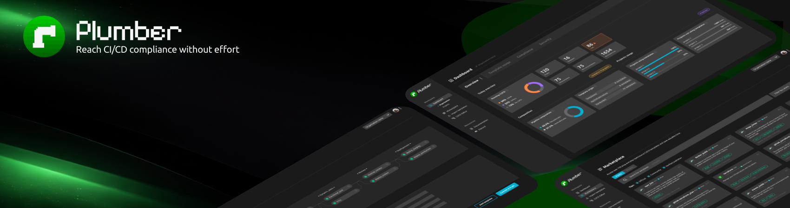

# Plumber - Website



**A modern website for Plumber (open-source CI/CD compliance CLI), built with Astro, Tailwind CSS, and React.**

### Summary of this README

| Section |
|--------|
| [Summary](#-summary) |
| [Quick Start](#-quick-start) |
| [Architecture & Technology Stack](#️-architecture--technology-stack) |
| [Project Structure](#-project-structure) |
| [Creating Content](#️-creating-content) |
| [Adding a new release blog post](#6-adding-a-new-release-blog-post) |
| [Creating Documentation Articles](#-creating-documentation-articles) |
| [Creating Custom Pages](#-creating-custom-pages) |
| [Component Patterns](#-component-patterns) |
| [Styling & Theming](#-styling--theming) |
| [Search Configuration](#-search-configuration) |
| [Internationalization (i18n)](#-internationalization-i18n) |
| [Content Management (Keystatic CMS)](#-content-management-keystatic-cms) |
| [Deployment](#-deployment) |
| [Development Tips](#️-development-tips) |
| [Content Collections API](#-content-collections-api) |
| [Configuration Files](#-configuration-files) |
| [Testing Locally](#-testing-locally) |
| [Additional Resources](#-additional-resources) |
| [Contributing](#-contributing) |
| [License](#-license) |
| [Support](#-support) |

---

## 📋 Summary

This is a comprehensive documentation and website for **Plumber** - a tool for analyzing GitLab CI/CD pipelines for security and compliance issues. Plumber helps you:

- Map out complex CI/CD landscapes
- Detect CI/CD security issues
- Ensure supply chain compliance
- Spot CI/CD technical debt
- Avoid supply chain attacks

The website features:
- 📝 **Blog** - Release notes, tutorials, and articles about CI/CD security
- 📚 **Documentation** - Comprehensive guides for installation, usage, and reference
- 🎨 **Marketing Pages** - Product landing pages and feature showcases
- 🔍 **Search** - Full-text search powered by Pagefind
- ✨ **CMS** - Keystatic CMS for content management

---

## 🚀 Quick Start

### Prerequisites

- Node.js 20+
- npm

### Installation & Setup

1. **Install dependencies:**
   ```bash
   npm install
   ```

2. **Run initial build:**
   ```bash
   npm run build
   ```

3. **Copy Pagefind for search:**
   - Windows: `npm run winsearch`
   - macOS/Linux: `npm run osxsearch`

4. **Configure i18n:**
   ```bash
   npm run config-i18n
   ```
   Follow the prompts to set up your language configuration.

5. **Start development server:**
   ```bash
   npm run dev
   ```
   Visit `http://localhost:4321`

### Available Commands

| Command | Action |
|---------|--------|
| `npm run dev` | Start local dev server at `localhost:4321` |
| `npm run build` | Build production site to `./dist/` with search indexing |
| `npm run preview` | Preview production build (not supported with Vercel adapter) |
| `npm run format` | Format code with ESLint and Prettier |
| `npm run lint` | Run ESLint |
| `npm run config-i18n` | Configure internationalization |
| `npm run remove-keystatic` | Remove Keystatic CMS if not needed |
| `npm run seo-audit` | Run SEO audit on the site |
| `npm run generate-favicon-ico` | Generate favicon.ico from favicon.svg |

---

## 🏗️ Architecture & Technology Stack

### Core Technologies

- **[Astro 5](https://astro.build)** - Static site generator with content collections
- **[Tailwind CSS 4](https://tailwindcss.com)** - Utility-first CSS framework
- **[React 19](https://react.dev)** - UI components (via Astro integration)
- **[TypeScript](https://www.typescriptlang.org)** - Type safety
- **[MDX](https://mdxjs.com)** - Markdown with JSX support

### Key Features & Tools

- **[Keystatic CMS](https://keystatic.com)** - Git-based CMS for content editing (accessible at `/keystatic` or `/admin`)
- **[Pagefind](https://pagefind.app)** - Fast static search
- **[Astro SEO](https://github.com/jonasmerlin/astro-seo)** - SEO optimization
- **[Astro Icon](https://www.astroicon.dev)** - Icon system using Tabler icons
- **Motion on Scroll** - Scroll-triggered animations

### Build & Deployment

- **Deployment**: Vercel (via `@astrojs/vercel` adapter)
- **Image Optimization**: Sharp image service
- **Compression**: HTML/JS compression via Playform Compress
- **RSS Feed**: Automatic RSS generation for blog posts

---

## 📁 Project Structure

```
.
├── .github/
│   └── workflows/          # CI/CD (lint, preview, production, security, seo-audit)
├── public/                 # Static assets
│   ├── favicons/
│   ├── robots.txt
│   └── social-media-card.png
├── scripts/                # Utility scripts
│   ├── config-i18n.js     # i18n configuration wizard
│   ├── generate-favicon-ico.js
│   ├── i18n/              # i18n management utilities
│   ├── remove-keystatic.js
│   └── seo-audit.js
├── src/
│   ├── assets/            # Images, videos (optimized by Astro)
│   ├── components/        # Reusable Astro/React components
│   │   ├── Hero/          # Hero sections
│   │   ├── Feature/       # Feature sections
│   │   ├── Cta/           # Call-to-action components
│   │   ├── Nav/           # Navigation
│   │   ├── Footer/        
│   │   └── ...
│   ├── config/            # Site configuration
│   │   ├── en/            # Locale-specific (siteData, navData, faqData, etc.)
│   │   ├── siteSettings.json.ts
│   │   └── translationData.json.ts
│   ├── data/              # Content collections data
│   │   ├── blog/          # Blog posts (by language)
│   │   │   └── en/        
│   │   ├── authors/       # Author profiles
│   │   ├── otherPages/    # Additional pages (privacy, terms)
│   │   └── codeToggles/   # Code example toggles
│   ├── docs/              # Documentation system
│   │   ├── components/    # Docs-specific components
│   │   │   └── mdx-components/  # MDX components (Aside, Badge, Tabs, etc.)
│   │   ├── config/        # Docs configuration
│   │   ├── data/          
│   │   │   └── docs/      # Documentation content (by language)
│   │   │       └── en/
│   │   ├── layouts/       # Docs layouts
│   │   └── styles/        # Docs-specific styles
│   ├── icons/             # SVG icons
│   │   ├── logos/         
│   │   └── tabler/        # Tabler icons
│   ├── js/                # Utility functions
│   │   ├── localeUtils.ts
│   │   └── translationUtils.ts
│   ├── layouts/           # Page layouts
│   │   ├── BaseLayout.astro
│   │   ├── BaseHead.astro
│   │   └── Blog*.astro    # Blog layouts
│   ├── pages/             # Route-based pages
│   │   ├── index.astro    # Homepage
│   │   ├── platform.astro # Platform product page
│   │   ├── blog/
│   │   │   ├── index.astro       # Blog list
│   │   │   └── [...slug].astro   # Blog post
│   │   ├── docs/
│   │   │   ├── index.astro       # Docs home
│   │   │   ├── [docsRoute]/index.astro
│   │   │   └── [...slug].astro   # Docs pages
│   │   ├── categories/    # Category pages
│   │   ├── contact.astro
│   │   ├── [...page].astro # Other pages (elements, privacy-policy, terms-of-use)
│   │   ├── 404.astro
│   │   └── rss.xml.ts     # RSS feed
│   ├── styles/            # Global styles
│   │   ├── global.css
│   │   ├── tailwind-theme.css
│   │   ├── buttons.css
│   │   ├── markdown-content.css
│   │   ├── fonts.css
│   │   ├── mos.css
│   │   └── keystatic.css
│   └── content.config.ts  # Content collections schema
├── astro.config.mjs       # Astro configuration
├── keystatic.config.tsx   # Keystatic CMS configuration
├── package.json
├── tsconfig.json
└── vercel.json            # Vercel deployment config
```

---

## ✍️ Creating Content

### Creating Blog Articles

Blog articles use MDX format and are stored in `src/data/blog/[locale]/`.

#### 1. File Structure

Create a folder with your article slug:

```
src/data/blog/en/my-article-name/
├── index.mdx          # Article content
├── heroImage.png      # Hero image (required)
└── other-images.png   # Additional images (optional)
```

#### 2. Article Frontmatter

Every blog article must have frontmatter at the top:

```mdx
---
title: Your Article Title
description: A compelling description for SEO and previews
draft: false
authors:
  - main-author
  - second-author
pubDate: 2024-01-15
updatedDate: 2024-01-20  # Optional
heroImage: ./heroImage.png
categories:
  - ci-cd
  - security
mappingKey: my-article  # Optional: for i18n matching
---

Your article content starts here...

## Headings

Write in Markdown/MDX format.


```

#### 3. Frontmatter Fields

| Field | Type | Required | Description |
|-------|------|----------|-------------|
| `title` | string | ✅ | Article title |
| `description` | string | ✅ | SEO description & preview text |
| `draft` | boolean | ❌ | Set to `true` to exclude from build |
| `authors` | array | ✅ | Array of author IDs (references `src/data/authors/`) |
| `pubDate` | date | ✅ | Publication date (YYYY-MM-DD) |
| `updatedDate` | date | ❌ | Last update date |
| `heroImage` | image | ✅ | Path to hero image |
| `categories` | array | ❌ | Array of category strings |
| `mappingKey` | string | ❌ | For linking translations |

#### 4. Adding Images

- **Hero images**: Place in the article folder, reference as `./heroImage.png`
- **Inline images**: Place in the article folder, reference with relative paths
- **Optimized**: All images are automatically optimized by Astro

#### 5. Using Components in Blog Posts

Auto-imported components (no import needed):
- `<Admonition>` - Info boxes

For other components, import them:

```mdx
---
title: My Article
---
import CustomComponent from '@components/CustomComponent.astro';

<CustomComponent prop="value" />
```

#### 6. Adding a new release blog post

To announce a new product release (e.g. **1.0.0 Plumber**), add a post under the **`releases/`** directory. These posts appear on the main blog page and in the RSS feed.

**Where to add it:** `src/data/blog/[locale]/releases/[version]/`

Example for release "1.0.0 Plumber":

```
src/data/blog/en/releases/1.0.0/
├── index.mdx          # Release notes content
├── heroImage.png      # Hero image (required)
└── screenshot.png     # Optional screenshots
```

Use the same frontmatter as any blog article. Include a `Releases` category so it’s easy to filter:

```mdx
---
title: 1.0.0 Plumber Release
description: Short description for SEO and previews
draft: false
authors:
  - plumber
pubDate: 2025-02-04
heroImage: ./heroImage.png
categories:
  - "Releases"
---
```

**Note:** Posts in **`archive/`** are *archived*: they only appear on [/blog/archive](/blog/archive), not on the main blog list. Use **`releases/`** for new release announcements and keep **`archive/`** for old/historical release notes (e.g. legacy R2Devops releases).

#### 7. Examples

See existing blog posts in `src/data/blog/en/` for reference:
- `archive/2.17/index.mdx` - Archived release notes (R2Devops)
- `releases/` - Add new Plumber release posts here
- `tj-actions-compromised/index.mdx` - Article example
- `top-5-cybersecurity-incidents-in-cicd/index.mdx` - Long-form article

### Creating Authors

Authors are defined in `src/data/authors/[author-id]/`.

**Structure:**

```
src/data/authors/john-doe/
├── index.mdx
└── avatar.jpg
```

**Content (index.mdx):**

```mdx
---
name: John Doe
avatar: ./avatar.jpg
about: DevOps engineer passionate about CI/CD security
email: john@example.com
authorLink: https://johndoe.com
---
```

---

## 📚 Creating Documentation Articles

Documentation articles use MDX and are stored in `src/docs/data/docs/[locale]/`.

#### 1. File Structure

**Option A: Single file**
```
src/docs/data/docs/en/getting-started.mdx
```

**Option B: Folder with index (recommended for images)**
```
src/docs/data/docs/en/installation/
├── index.mdx
└── img/
    └── screenshot.png
```

**Option C: Nested sections**
```
src/docs/data/docs/en/installation/
├── index.mdx
├── docker-compose.mdx
├── kubernetes.mdx
└── img/
    └── diagrams.svg
```

#### 2. Documentation Frontmatter

```mdx
---
title: Getting Started with Plumber
description: Learn how to install and use Plumber CLI
sidebar:
  label: Quick Start        # Label in sidebar (defaults to title)
  order: 1                  # Order in sidebar
  badge:
    text: New
    variant: tip            # note, tip, caution, danger, info
tableOfContents:
  minHeadingLevel: 2
  maxHeadingLevel: 3
pagefind: true              # Include in search (default: true)
draft: false                # Exclude from build if true
mappingKey: getting-started # For i18n
---

## Your documentation content

Write your docs here in Markdown/MDX.
```

#### 3. Frontmatter Fields

| Field | Type | Required | Description |
|-------|------|----------|-------------|
| `title` | string | ✅ | Page title |
| `description` | string | ❌ | SEO description |
| `sidebar.label` | string | ❌ | Sidebar text (defaults to title) |
| `sidebar.order` | number | ❌ | Sidebar position |
| `sidebar.badge` | object | ❌ | Badge with text & variant |
| `tableOfContents` | object | ❌ | TOC configuration |
| `pagefind` | boolean | ❌ | Include in search (default: true) |
| `draft` | boolean | ❌ | Exclude from build |
| `mappingKey` | string | ❌ | For i18n matching |

#### 4. Using MDX Components in Docs

The following components are auto-imported in all documentation files:

##### Aside / Admonition

```mdx
<Aside variant="note">
  This is a note callout.
</Aside>

<Aside variant="tip">
  This is a helpful tip!
</Aside>

<Aside variant="caution">
  Be careful with this.
</Aside>

<Aside variant="danger">
  This is dangerous!
</Aside>
```

**Variants**: `note`, `tip`, `caution`, `danger`, `info`

##### Badge

```mdx
<Badge variant="tip">New</Badge>
<Badge variant="caution">Deprecated</Badge>
```

##### Button

```mdx
<Button href="/docs/installation">Get Started</Button>
<Button variant="secondary">Learn More</Button>
```

##### Steps

```mdx
<Steps>
1. First, install the dependencies
   ```bash
   npm install
   ```

2. Then configure your settings
   
3. Finally, run the build
</Steps>
```

##### Tabs

```mdx
<Tabs defaultValue="npm">
  <TabsList>
    <TabsTrigger value="npm">npm</TabsTrigger>
    <TabsTrigger value="pnpm">pnpm</TabsTrigger>
  </TabsList>
  
  <TabsContent value="npm">
    ```bash
    npm install plumber-cli
    ```
  </TabsContent>
  
  <TabsContent value="pnpm">
    ```bash
    pnpm add plumber-cli
    ```
  </TabsContent>
</Tabs>
```

#### 5. Documentation Navigation

The sidebar is auto-generated from:
1. The folder structure in `src/docs/data/docs/[locale]/`
2. The `sidebar.order` values in frontmatter
3. The `sidebar.label` values (or falls back to `title`)

**Tips:**
- Use `sidebar.order` to control positioning
- Folders become collapsible sections
- `index.mdx` files become the section's main page

#### 6. Examples

See existing docs for reference:
- `src/docs/data/docs/en/getting-started/index.mdx` - Overview
- `src/docs/data/docs/en/installation/` - Multiple pages (docker-compose, kubernetes, podman, etc.)
- `src/docs/data/docs/en/components/` - MDX components (Aside, Badge, Button, Steps, Tabs)
- `src/docs/data/docs/en/use-plumber/` - Controls, issues, register-templates, roles-permissions

---

## 🎨 Creating Custom Pages

### Creating a Static Page

Create a new `.astro` file in `src/pages/`:

```astro
---
// src/pages/about.astro
import BaseLayout from '@layouts/BaseLayout.astro';
import Hero1 from '@components/Hero/Hero1.astro';
---

<BaseLayout 
  title="About Us" 
  description="Learn about our mission"
>
  <Hero1 />
  
  <section class="container mx-auto px-4 py-16">
    <h2>Our Story</h2>
    <p>Content here...</p>
  </section>
</BaseLayout>
```

This creates a route at `/about`.

### Creating Dynamic Pages

Use `[param].astro` for dynamic routes:

```astro
---
// src/pages/product/[id].astro
export async function getStaticPaths() {
  return [
    { params: { id: 'plumber' } },
    { params: { id: 'platform' } },
  ];
}

const { id } = Astro.params;
---

<BaseLayout title={`Product: ${id}`}>
  <!-- Content -->
</BaseLayout>
```

---

## 🧩 Component Patterns

### Using Existing Components

The project includes many pre-built components:

```astro
---
import Hero1 from '@components/Hero/Hero1.astro';
import Feature1 from '@components/Feature/Feature1.astro';
import Cta1 from '@components/Cta/Cta1.astro';
import Pricing1 from '@components/Pricing/Pricing1.astro';
---

<Hero1 />
<Feature1 />
<Pricing1 />
<Cta1 />
```

### Component Categories

- **Hero** - Hero sections for landing pages
- **Feature** - Feature showcase sections
- **Cta** - Call-to-action sections
- **Pricing** - Pricing tables
- **Testimonials** - Customer testimonials
- **LogoCloud** - Client/partner logos
- **PostCard** - Blog post cards
- **SiteLogo** - Site logo (nav, footer, mobile)
- **Nav / Footer** - Navigation and footer

### Creating Custom Components

```astro
---
// src/components/MyComponent/MyComponent.astro
interface Props {
  title: string;
  description?: string;
}

const { title, description } = Astro.props;
---

<div class="my-component">
  <h2>{title}</h2>
  {description && <p>{description}</p>}
  <slot />
</div>

<style>
  .my-component {
    /* Component-scoped styles */
  }
</style>
```

**Usage:**

```astro
---
import MyComponent from '@components/MyComponent/MyComponent.astro';
---

<MyComponent title="Hello" description="World">
  <p>Slotted content</p>
</MyComponent>
```

---

## 🎨 Styling & Theming

### Tailwind Configuration

Tailwind 4 is configured via CSS variables in `src/styles/tailwind-theme.css`:

```css
@theme {
  --color-primary-*: ...;
  --color-secondary-*: ...;
}
```

### Global Styles

Located in `src/styles/`:
- `global.css` - Base styles, CSS variables
- `buttons.css` - Button variants
- `markdown-content.css` - Markdown rendering styles
- `fonts.css` - Font imports

### Dark Mode

Dark mode is implemented via CSS classes. Toggle component: `ThemeToggle.astro`

---

## 🔍 Search Configuration

Search is powered by Pagefind, built during the production build.

**Configuration:**
- Automatically indexes all pages
- Control indexing with `data-pagefind-ignore` attribute
- Control in docs with `pagefind: false` in frontmatter

**Building search index:**
```bash
npm run build  # Runs pagefind and copies index into Vercel output for deployed search
```

---

## 🌐 Internationalization (i18n)

### Current Setup

- Default language: English (`en`)
- Locale prefix: Disabled for default locale

### Adding a New Language

1. Run the i18n configuration wizard:
   ```bash
   npm run config-i18n
   ```

2. Follow the prompts to add a new locale

3. The script will:
   - Update `astro.config.mjs`
   - Update `keystatic.config.tsx`
   - Update site settings
   - Create content folders for the new locale

### Manual Translation

After adding a locale, translate content by:
1. Copying content from `src/data/blog/en/` to `src/data/blog/[locale]/`
2. Copying docs from `src/docs/data/docs/en/` to `src/docs/data/docs/[locale]/`
3. Updating `src/config/translationData.json.ts`

---

## 📝 Content Management (Keystatic CMS)

### Accessing Keystatic

- **Local development**: `http://localhost:4321/keystatic`
- **Production**: `https://yoursite.com/keystatic`

### Configuration

Keystatic is configured in `keystatic.config.tsx`. Current collections:
- `blogEN` - Blog posts (English)
- `authors` - Author profiles
- `otherPagesEN` - Additional pages

### Authentication

- **Local**: No authentication required
- **Production**: Uses Keystatic Cloud (requires account)

### Removing Keystatic

If you don't need a CMS:

```bash
npm run remove-keystatic
```

---

## 🚀 Deployment

### Vercel (Recommended)

The project is configured for Vercel deployment:

1. Connect your repository to Vercel
2. Vercel auto-detects Astro
3. Build command: `npm run build`
4. Output directory: `dist`

Configuration is in `vercel.json` and uses the `@astrojs/vercel` adapter.

### Other Platforms

To deploy on other platforms:

1. Update the adapter in `astro.config.mjs`
2. Follow Astro's [deployment guides](https://docs.astro.build/en/guides/deploy/)

### Environment Variables

For Keystatic Cloud in production:
- Set up a project at [keystatic.cloud](https://keystatic.cloud)
- Configure OAuth if needed

---

## 🛠️ Development Tips

### Hot Module Replacement (HMR)

Astro provides fast HMR for:
- Astro components
- MDX files
- Styles
- React components

### TypeScript

TypeScript is fully configured. Run type checking:

```bash
npx astro check
```

### Linting & Formatting

```bash
npm run lint      # Check for issues
npm run format    # Auto-fix issues
```

### Code Tours

Install the [CodeTour extension](https://marketplace.visualstudio.com/items?itemName=vsls-contrib.codetour) to view guided tours in `.tours/`.

---

## 📦 Content Collections API

### Querying Blog Posts

```astro
---
import { getCollection } from 'astro:content';

// Get all blog posts
const allPosts = await getCollection('blog');

// Filter published posts
const publishedPosts = await getCollection('blog', ({ data }) => {
  return !data.draft;
});

// Get by category
const securityPosts = allPosts.filter(post => 
  post.data.categories?.includes('security')
);
---
```

### Querying Docs

```astro
---
import { getCollection } from 'astro:content';

const docs = await getCollection('docs');
---
```

### Rendering Content

```astro
---
import { getEntry } from 'astro:content';

const post = await getEntry('blog', 'my-article-name');
const { Content } = await post.render();
---

<article>
  <h1>{post.data.title}</h1>
  <Content />
</article>
```

---

## 🔧 Configuration Files

### `astro.config.mjs`

Main Astro configuration:
- Site URL, image service
- Integrations (MDX, React, Sitemap, Keystatic, Compress, etc.)
- Markdown settings (Shiki syntax highlighting)
- i18n configuration
- Auto-imports for MDX

### `content.config.ts`

Content collections schema:
- Defines validation for frontmatter (blog, authors, docs, otherPages)
- Configures content loaders
- Sets up relationships (e.g. blog posts → authors)

### `package.json`

Dependencies and scripts. Key packages:
- Astro 5.x
- Tailwind CSS 4.x
- React 19.x
- Keystatic CMS
- Pagefind (search)
- Node 20+

### `tsconfig.json`

TypeScript configuration with path aliases:
- `@components/*` → `src/components/*`
- `@layouts/*` → `src/layouts/*`
- `@js/*` → `src/js/*`
- etc.

---

## 🧪 Testing Locally

### Full Production Build

```bash
npm run build
```

**Note:** With the Vercel adapter, `npm run preview` is not supported. To test the built site locally, use a static server (e.g. `npx serve dist/client -p 4321`) or deploy to a Vercel preview.

### Test Search

Search only works after running a production build:

```bash
npm run build
npm run winsearch  # or osxsearch
npm run dev
```

---

## 📚 Additional Resources

### Plumber

- **Plumber CLI**: Open-source GitLab CI/CD compliance tool
- **Plumber Platform**: Full-featured compliance and security platform
- **Discord Community**: Join for support and discussions
- **Support Email**: hello@getplumber.io

### Framework Documentation

- [Astro Documentation](https://docs.astro.build)
- [Astro Discord](https://astro.build/chat)
- [Tailwind CSS Documentation](https://tailwindcss.com/docs)
- [MDX Documentation](https://mdxjs.com)
- [Keystatic Documentation](https://keystatic.com/docs)

### Related Tools

- [Pagefind](https://pagefind.app) - Static search
- [Vercel](https://vercel.com/docs) - Deployment platform

---

## 🤝 Contributing

When contributing content:

1. Follow the established patterns in existing content
2. Use the frontmatter schemas defined in `content.config.ts`
3. Test locally before committing
4. Ensure all images are optimized
5. Run linting: `npm run format`

---

## 📄 License

See license details at the main Plumber project repository.

---

## 🆘 Support

- **Technical Issues**: Open an issue in the repository
- **Content Questions**: Contact via Discord or support email
- **Theme/Styling**: Refer to Cosmic Themes documentation (original theme base)

---

**Built with ❤️ by the Plumber team**

*Securing CI/CD pipelines, one commit at a time.*
