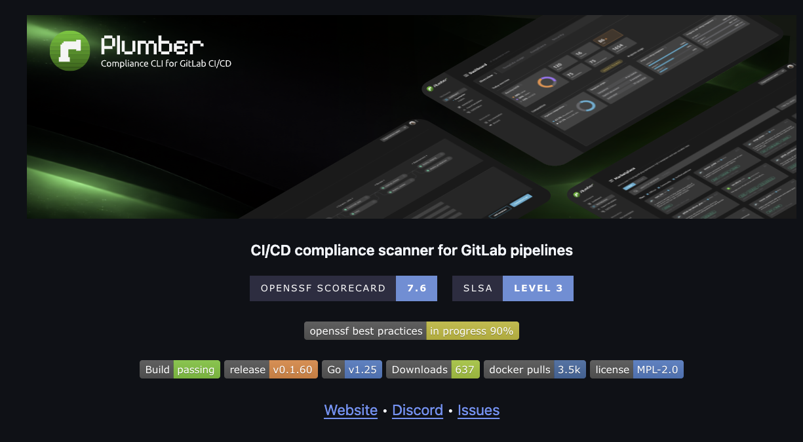
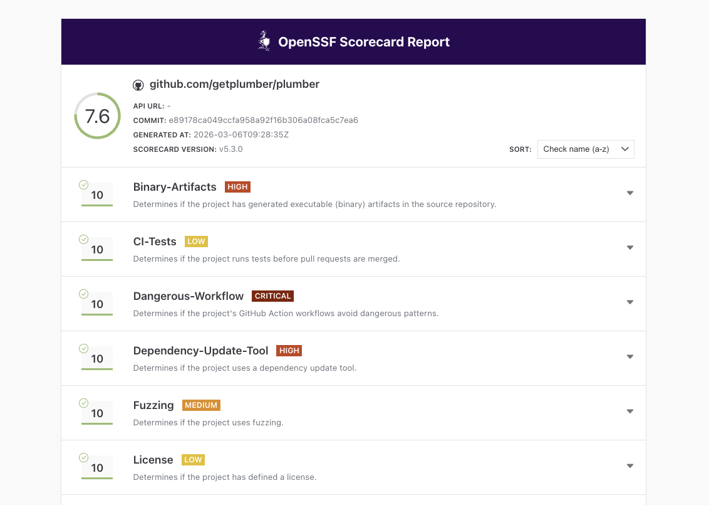

Plumber helps you enforce compliance in your GitLab pipelines. But who watches the watcher? If an attacker compromised Plumber's own release process, every project relying on it would be at risk. That's why we invested in hardening our supply chain with three industry-standard frameworks: **SLSA Level 3 provenance**, **OpenSSF Scorecard**, and the **OpenSSF Best Practices** badge.

This post walks through what each of these means, what we changed, and how the results look.



## Why Supply Chain Security Matters

In early 2026, the [hackerbot-claw supply chain attack](/blog/hackerbot-claw-cicd-governance) compromised `aquasecurity/trivy` and six other major repositories by exploiting weak CI/CD configurations: mutable action tags, overly permissive tokens, and workflows that trusted external pull requests with write access.

That attack specifically exploited `pull_request_target` triggers and mutable GitHub Action tags to inject code into trusted CI pipelines. Our hardening steps below address some of the same underlying weaknesses (mutable references, excessive permissions, unsigned releases) but not the full attack chain. For example, defending against `pull_request_target` abuse requires careful workflow design beyond what's covered here.

The conceptual overlap with Plumber is real: Plumber detects mutable tags, missing branch protections, and unsafe variable expansion in GitLab pipelines. The same categories of risk exist in GitHub Actions, just with different mechanics. Hardening our own GitHub release pipeline was a natural extension of the principles we enforce for others.

## The Three Pillars

### SLSA Level 3 Provenance

[SLSA](https://slsa.dev) (Supply-chain Levels for Software Artifacts, pronounced "salsa") is a framework by Google and the OpenSSF for ensuring the integrity of software artifacts. It defines four levels of increasing assurance about how software was built.

**Level 3** means:

- The build runs on a **hardened, hosted build platform** (GitHub Actions in our case)
- Build provenance is **generated by the build service**, not the project itself, so it can't be forged
- The provenance is **non-falsifiable**: even a compromised project maintainer cannot tamper with it
- Users can **cryptographically verify** that a binary was built from a specific commit using the expected build process

#### What this does and doesn't protect against

SLSA provenance addresses **post-build tampering**: someone replacing a release binary, a compromised CI pipeline producing unexpected output, or a hijacked maintainer account publishing poisoned artifacts. It proves that the binary you downloaded was built from the expected source, on trusted infrastructure.

It does **not** guarantee the source code is free of vulnerabilities, that build dependencies weren't compromised, or that the build environment itself was clean. It's a seal of origin, not a clean bill of health.

#### How we generate attestations

Every Plumber release generates build provenance attestations using GitHub's [`actions/attest-build-provenance`](https://github.com/actions/attest-build-provenance). The attestations are signed via Sigstore using the GitHub Actions OIDC identity and stored in [GitHub's attestation store](https://docs.github.com/en/actions/security-for-github-actions/using-artifact-attestations/using-artifact-attestations-to-establish-provenance-for-builds), visible in the GitHub web UI under **Actions > Attestations**.

#### When and how to verify

You should verify attestations before deploying a binary to production, in automated deployment pipelines, and after any security incident to confirm previously deployed binaries are genuine.

```bash
# Download the binary from the release page
gh release download v0.3.19 --repo getplumber/plumber \
  --pattern 'plumber-linux-amd64'

# Verify its provenance
gh attestation verify plumber-linux-amd64 --repo getplumber/plumber
```

No extra tools needed. The `gh` CLI fetches the attestation from GitHub's store and checks it automatically. On success, this confirms the binary was built from the expected commit, on GitHub's infrastructure, and wasn't modified after the build.

If you deploy container images to Kubernetes, you can enforce attestation verification at the cluster level with a policy engine like [Kyverno](https://kyverno.io/). A `ClusterPolicy` with `verifyImages` can reject pods whose images lack a valid SLSA provenance attestation signed by the expected GitHub Actions workflow, turning verification into an automated guardrail rather than a manual step.

### OpenSSF Scorecard

The [OpenSSF Scorecard](https://securityscorecards.dev) is an automated tool that evaluates open-source projects against a set of security heuristics. Each check scores from 0 to 10, producing an aggregate score that reflects how well the project follows security best practices.

Plumber currently scores **7.6/10**, with perfect 10s on most checks:



You can check the live report at [securityscorecards.dev](https://securityscorecards.dev/viewer/?uri=github.com/getplumber/plumber).

### OpenSSF Best Practices Badge

The [OpenSSF Best Practices](https://www.bestpractices.dev) program (formerly CII Best Practices) is a self-certification that evaluates a project against a comprehensive checklist covering documentation, change control, reporting, quality, security, and analysis.

Plumber is currently at **90% on the Passing level**, covering:

- **Basics**: Project website, documentation, contribution guidelines, FLOSS license
- **Change Control**: Public git repository with unique version numbering (SemVer)
- **Reporting**: Issue tracker, bug report templates, vulnerability reporting via GitHub Security Advisories
- **Quality**: Automated test suite, CI on every commit, linting and static analysis
- **Security**: Secure development knowledge, HTTPS delivery, SLSA provenance, no leaked credentials
- **Analysis**: CodeQL, govulncheck, fuzz testing

You can follow our progress at [bestpractices.dev/projects/12096](https://www.bestpractices.dev/en/projects/12096).

## What We Changed

### Release Workflow Hardening

- **SLSA provenance generation**: The release workflow uses `actions/attest-build-provenance` to generate signed SLSA Level 3 attestations for every binary, stored in GitHub's attestation store
- **SHA-pinned actions**: All GitHub Actions across all four workflows are now pinned by commit SHA, not mutable tags. This prevents the exact attack vector used in the hackerbot-claw incident
- **Least-privilege tokens**: Workflow-level `permissions: {}` (deny-all) with job-level overrides granting only what each step needs
- **No persisted credentials**: `persist-credentials: false` on every checkout step, so `GITHUB_TOKEN` isn't available to subsequent steps

### Security Infrastructure

- **SECURITY.md**: Vulnerability reporting instructions pointing to GitHub Security Advisories, with response timeline commitments
- **OpenSSF Scorecard workflow**: Runs weekly and on every push to `main`, publishing results to the Scorecard API and uploading SARIF to GitHub's Security tab
- **Fuzz tests**: Native Go fuzz tests for the boolean expression parser (`ParseRequiredExpression`) and git remote URL parser (`ParseGitRemoteURL`)

### Cleanup

- Removed an accidentally committed compiled `main` binary from the source tree (this was dragging down the Binary-Artifacts score)
- Added `main` to `.gitignore`

## Want to Apply This to Your Own Project?

We wrote a companion post with step-by-step instructions, workflow snippets, and Scorecard impact for each change:

**[6 Practical Steps to Harden Your GitHub Project's Supply Chain](/blog/harden-github-supply-chain)**

It covers SHA-pinned actions, SLSA provenance setup, least-privilege permissions, persisted credentials, the Best Practices badge, and the Scorecard action, all with copy-paste YAML examples.

## What's Next

We're working toward 100% on the Best Practices badge and continuing to improve our Scorecard score. The main remaining items are enabling required PR reviews and status checks on the `main` branch (Branch-Protection) and growing the contributor review process (Code-Review).

Supply chain security is not a one-time checkbox. It's an ongoing practice. The same way Plumber continuously monitors your GitLab pipelines for compliance drift, these frameworks continuously evaluate whether your project's security posture is holding up.

## Links

- [Plumber on GitHub](https://github.com/getplumber/plumber)
- [OpenSSF Scorecard Report](https://securityscorecards.dev/viewer/?uri=github.com/getplumber/plumber)
- [OpenSSF Best Practices Badge](https://www.bestpractices.dev/en/projects/12096)
- [SLSA Framework](https://slsa.dev)
- [PR #96: Add SLSA 3, OpenSSF Scorecard, and security hardening](https://github.com/getplumber/plumber/pull/96)
- [Plumber Documentation](/docs/cli/)
- [Discord Community](/discord)
