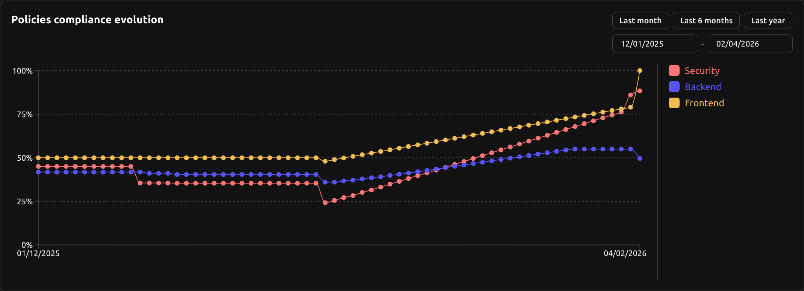

import plumberLogo from './plumber.svg';

**We're thrilled to announce the launch of Plumber 1.0:**

> **🚀 A new name, a new identity, and exciting new features**

**This release marks a major milestone as we rebrand from R2Devops to Plumber,
along with new user activity tracking capabilities and enhanced dashboard
controls.**

## 🔄 Rebranding: From R2Devops to Plumber

We're excited to introduce our new identity: **Plumber**. This rebrand reflects
our evolved mission and vision for the future of CI/CD compliance and security.

Everything you loved about R2Devops is still here. Same powerful features, same
commitment to securing your pipelines, now under a fresh new name that better
represents what we do: helping you build compliant, leak-free CI/CD pipelines.

**What's changing:**
- **New name**: R2Devops is now Plumber
- **New look**: Updated branding across the platform
- **Same great features**: All your existing configurations and data remain intact

## 👤 User Activity Tracking

Gain better visibility into user engagement and platform usage with
comprehensive activity tracking.

**New tracking capabilities:**
- **Signup date**: Know when each user joined your instance
- **Last login**: Track when users last accessed the platform
- **Last activity date**: Monitor ongoing engagement
- **Fix history**: Complete history of all fixes run through the Plumber interface

This gives better insights into team adoption.

## 📊 Chart Time Range Controls

Take control of your dashboards with the new chart time range feature.
- Customize the time period displayed in charts to see the data range that
matters most to you
- Compare compliance changes across different timeframes.

## ⚙️ Minor Updates

- **Fix**: Various bug fixes and stability improvements
- **Fix**: Resolve package CVEs for enhanced security
- **UX improvements**: Various UX enhancements across the platform
- **Accessibility**: Improve accessibility of policies configuration for better usability

---

<Admonition variant="info">
Versions
- Backend: `v2.36.4`
- Frontend: `v2.32.4`
- Helm chart: `v1.0.1`
</Admonition>
