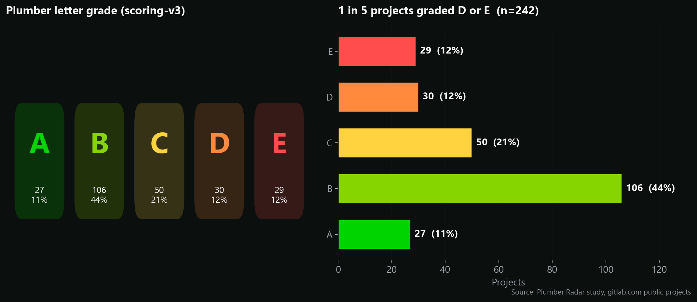
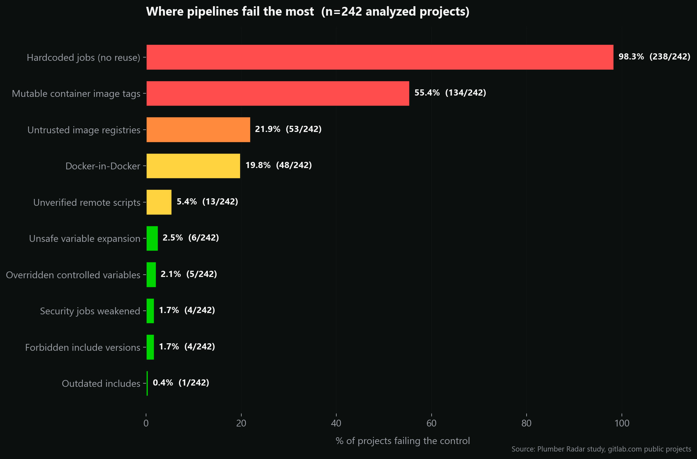
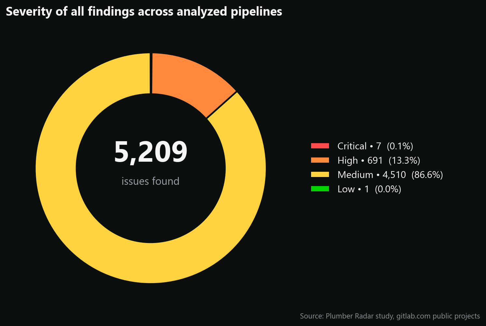
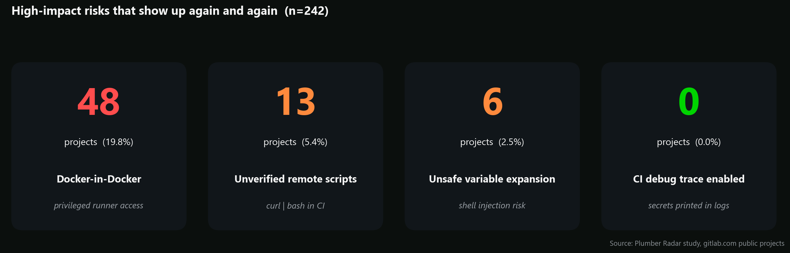

> **Every time a pipeline runs, it downloads images, fetches templates, and executes shell scripts, often with secret access to your infrastructure. We wanted to know: _what does the CI/CD code the open-source world actually ships look like under a security lens?_**

To answer that, we pointed the open-source [Plumber CLI](https://github.com/getplumber/plumber) at **242 public GitLab projects**, ran a reproducible compliance scan on each one, and aggregated the results. The same analysis (charts, cohort, drill-down) lives on **[Plumber Radar](/radar)**, refreshed continuously, so the live numbers may differ slightly from the snapshot we publish here. This post is the 2026 edition of that study, with the full methodology, the raw numbers, and what they mean if you ship on GitLab.

The tooling and the scan driver are themselves open source, so every figure below is re-runnable.

## TL;DR

- **242 public GitLab projects** were analyzed end-to-end with the Plumber CLI.
- **The average pipeline gets a Plumber `C`** (scoring-v3, A → E). Roughly **1 in 4 projects** ranks **D or E**, the band where overlapping security issues stack up.
- Plumber surfaced **5,209 issues** total. **698** of them are **High or Critical**, the short list a real compliance dashboard would page on.
- **98.3%** of pipelines rely on **hardcoded jobs** instead of reusable components or templates.
- **55.4%** of pipelines still use **mutable container image tags** (`latest`, `main`, version floaters).
- **19.8%** of pipelines embed **Docker-in-Docker**, the single most powerful sandbox escape in CI.

## The headline: an industry that sits at **C**

Numeric percentages are noisy and hard to compare across projects of very different shapes. That's why Plumber introduced a **letter grade (A–E)** on top of the raw score, capped by a critical-finding malus (if even one Critical issue is unresolved, the letter is floored). See the [scoring specification](https://github.com/getplumber/plumber/blob/main/docs/scoring.md) for the exact weights.

When we average those grades across the 242 analyzed pipelines, **the open-source GitLab ecosystem grades a C**.



A few things worth pulling out of that distribution:

- **44% of projects are graded B.** That's "one or two high-severity categories failing, few medium ones". It's the band where most healthy projects with a couple of bad habits sit.
- **24% are D or E** — about **1 in 4**. That's the danger zone: several overlapping security issues at once, the kind of pipeline where a single supply-chain incident would propagate easily.
- **Only 11% earn an A.** They share the same fingerprint: small jobs, a tight set of trusted images, and pipelines composed from [GitLab components](https://docs.gitlab.com/ee/ci/components/) instead of copy-pasted YAML.

That `C` headline is the story of the long tail. The popular OSS world keeps the lights on, but on a security-and-supply-chain axis, it has clear, recurring weak spots — and they are the same weak spots from one project to the next.

## Where pipelines fail the most

The grade is interesting, but the **per-control** view is where the story gets concrete. Plumber runs 13 controls on each pipeline; here's how often each one fell below 100% across the cohort.



A few observations:

### 1. Hardcoded jobs are essentially universal (98.3%)

Out of 242 pipelines, **238** have at least one hardcoded job: a job defined inline, rather than inherited from a GitLab [component](https://docs.gitlab.com/ee/ci/components/) or [template](https://docs.gitlab.com/ee/ci/yaml/includes.html). Across the whole cohort Plumber counted **3,180 hardcoded jobs** out of **4,740 total jobs**, roughly **two thirds** of every pipeline job in the ecosystem.

This is the single biggest lever for audit and reuse. A pipeline entirely composed of catalog components is trivial to version, to compare across projects, and to patch in one place when a new vulnerability shows up.

<Admonition variant="info">
On OSS projects this number is expected to be high, since maintainers typically don't have an internal component catalog. The more interesting signal is the _direction_: once GitLab Component Catalog adoption picks up, this is the first metric that should drop.
</Admonition>

### 2. Mutable image tags are still the norm (55.4%)

**134 projects** ship at least one job that references a container image with a mutable tag (`latest`, `main`, `dev`, `edge`, or even unpinned major versions like `python:3`). Over time, those tags silently change under you, which is exactly the mechanism behind the [`tj-actions/changed-files` supply chain compromise](/blog/tj-actions-compromised) and the [`hackerbot-claw` incident](/blog/hackerbot-claw-cicd-governance) earlier this year.

Mutable tags are the cheapest thing to fix and they give you a real security return.

### 3. One in five projects runs Docker-in-Docker (19.8%)

**48 projects** run Docker-in-Docker as a CI service. DinD is almost always configured as a privileged container, which effectively gives every CI job **root access to the host runner**, and therefore to the secrets of every other project sharing that runner. It's not theoretical: it's the most commonly discussed runner-level sandbox escape.

Of those 48, a further subset also exposes an **insecure (non-TLS) Docker daemon** over the runner network: a known man-in-the-middle surface that Plumber surfaced in **36 separate findings** across the cohort.

## What 698 High and Critical findings tell us

Aggregating **every issue Plumber emitted across every project** gives us the closest thing to a portfolio-wide backlog:



**5,209 findings** in total. The mass of that number is Medium severity (most of it is the hardcoded-jobs count), which is expected. The interesting pocket is the **698 High or Critical findings** — what the industry would actually wake up at 3am for:

- **349 untrusted image pulls** (ISSUE-101, High) — pipelines pulling from registries that are neither your trusted catalog nor a vetted public host. The single biggest supply-chain entry point.
- **301 Docker-in-Docker daemons** (ISSUE-412 / ISSUE-413, High) across privileged and insecure-TLS modes — every privileged DinD service on a shared runner is a sandbox-escape away from harvesting every other project's secrets.
- **35 unverified remote script fetches** (ISSUE-411, High) — jobs that `curl | bash` an external URL at runtime. The blueprint of how `tj-actions/changed-files` propagated.
- **7 weakened security jobs** (ISSUE-410, Critical under scoring-v3) across **4 projects** — SAST, secret-detection or container-scanning explicitly downgraded with `allow_failure: true` against policy. These are the pipelines that look green while their security gates are silently disabled.
- **6 job-level overrides of controlled variables** (ISSUE-205, High) — a direct way to disable SAST or redirect security scanners to a fake registry.

Read together, the message to the industry is consistent: **the security problems on GitLab CI today aren't exotic zero-days, they're configuration**. Untrusted registries, unpinned tags, privileged daemons, weakened scanners, and remote scripts piped into a shell. All of them visible in YAML. All of them invisible in a typical code review.

## A handful of high-blast-radius risks

Some controls fail in very few projects but carry outsized consequences when they do. These four deserve individual attention on any security review checklist:



- **Docker-in-Docker (48 projects)**: every privileged DinD runner is effectively a shared-secret honeypot.
- **Unverified remote scripts (13 projects)**: `curl https://... | sh` lines in CI hand attackers a direct in-flight tampering vector.
- **Unsafe variable expansion (6 projects)**: lets an attacker inject shell commands through a crafted branch name, MR title, or commit message.
- **CI debug trace enabled (0 projects)**: nobody in the cohort still ships `CI_DEBUG_TRACE=true` on the default branch — a small but real win for the ecosystem compared to previous waves.

The conclusion isn't that "open source is broken". It's that these issues are **invisible in a code review**. They live in pipeline YAML, sometimes hidden three `include:` levels deep, but a linter designed for CI catches them in seconds.

## Reproducing this yourself

Everything above comes from the exact same command a Plumber user runs on their own project:

```bash
plumber analyze \
  --gitlab-url https://gitlab.com \
  --project <group>/<project> \
  --config config/study.plumber.yaml
```

If you want to scan your own portfolio:

1. **Install Plumber**: `brew install getplumber/plumber/plumber`, or see the [installation docs](/docs/cli/installation).
2. **Generate a starter policy**: `plumber config generate`, then tune it.
3. **Run `plumber analyze`** from a repository root, or in CI as a [drop-in component](/docs/cli/gitlab-component/):

   ```yaml
   include:
     - component: gitlab.com/getplumber/plumber/plumber@v0.2.1
   ```

4. **Compare against the cohort**: the JSON artifact Plumber writes is fully machine-readable and ships its own letter grade.


## What's next

This is the first edition. A second pass is planned with **digest pinning enabled**, to quantify the gap between "we use tagged images" (today's baseline) and "we use cryptographically pinned images" (the hardened baseline). We're also preparing a cross-platform comparison with GitHub Actions.

If you'd like to be notified when the next edition drops, or to contribute [join the Plumber Discord](/discord).

<Admonition variant="info">
Study metadata
- Snapshot date: May 2026 • gitlab.com public projects
- Cohort: 242 analyzed (the same scope as the [Plumber Radar](/radar) default view; first-party `gitlab-org/*` and `gitlab-com/*` namespaces excluded)
- Plumber CLI: `v0.2.22` (commit `a613467`)
- Scoring profile: `scoring-v3`
- Policy: `config/study.plumber.yaml` (digest pinning disabled, OSS-friendly trusted registries)
- Raw artifacts & scripts: [Plumber Radar](/radar)
</Admonition>

## Links

- [Plumber CLI on GitHub](https://github.com/getplumber/plumber)
- [GitLab CI component catalog](https://gitlab.com/explore/catalog/getplumber/plumber)
- [Plumber documentation](/docs/cli/)
- [Scoring specification (A–E)](https://github.com/getplumber/plumber/blob/main/docs/scoring.md)
- [Plumber Radar (study dashboard)](/radar)
- [Discord community](/discord)
