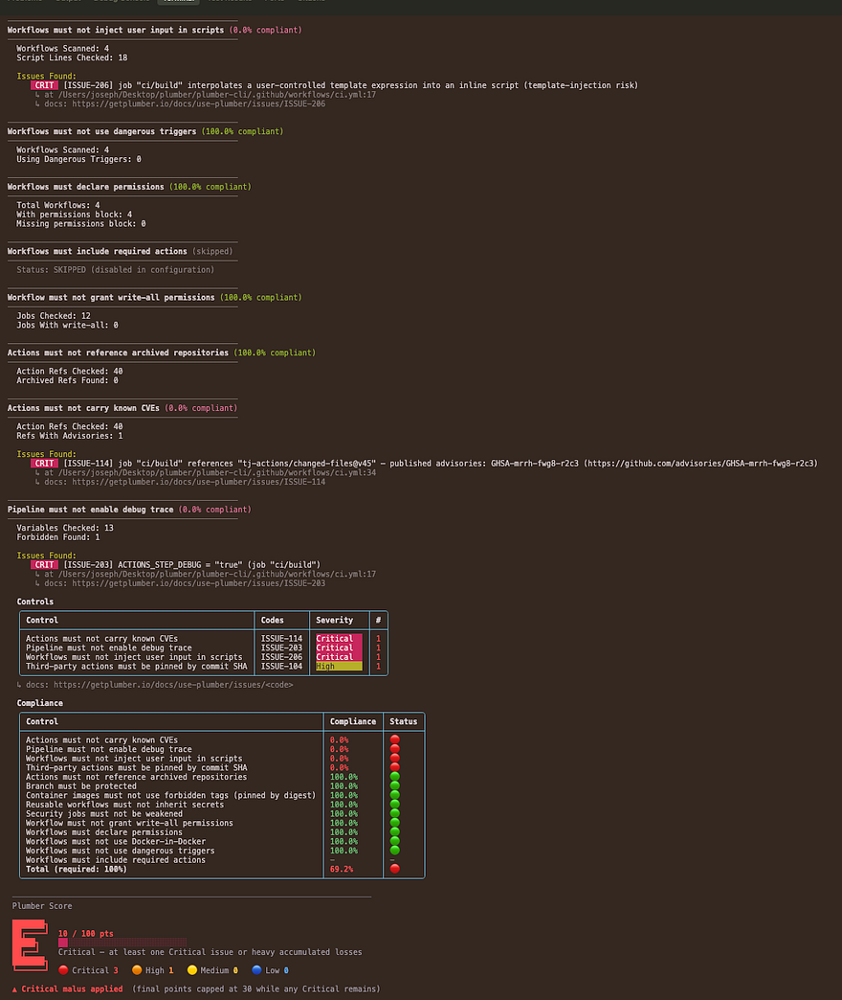

import { Icon } from "astro-icon/components";

This page covers the **GitHub Actions** particulars of the Plumber CLI: how to authenticate, the controls that ship for GitHub, the issues they emit, and a complete `github.controls:` configuration block. For installation and the provider-agnostic command reference, see the [main CLI page](/docs/cli).

On GitHub Actions, Plumber flags issues like:

- Third-party actions not pinned by commit SHA, the tj-actions / reviewdog supply chain vector (CVE-2025-30066)
- Actions hosted in archived repositories or carrying published GitHub Advisory entries
- Dangerous triggers (`pull_request_target`, `workflow_run`) that expose secrets to PR-author code
- Template injection via `${{ github.event.* }}` inlined into shell scripts
- Reusable workflows called with `secrets: inherit` instead of named-secret passing
- Implicit / over-broad `permissions:` blocks and `permissions: write-all` grants
- Debug-trace toggles (`ACTIONS_STEP_DEBUG`, `ACTIONS_RUNNER_DEBUG`) that leak secrets into job logs
- Docker-in-Docker services and weakened security jobs

## Quick Start

<Steps>
1. **Install Plumber** ([Installation](#installation) below): Homebrew, mise, a prebuilt binary, Docker, or from source.

2. **Authenticate**: run `gh auth login`, or set `GH_TOKEN` (see [Authentication](#authentication) below).

3. **Run the scan** from inside your checked-out repo, or against a remote one (see [Running a scan](#running-a-scan)):

   ```bash
   plumber analyze
   ```

4. **Read the report**: a per-control compliance breakdown and a letter grade, plus an optional JSON report, PBOM, and CycloneDX SBOM (see [Example Output](#example-output)).
</Steps>


## Installation

<Aside variant="info">
  Trying a beta? Homebrew, mise, and Docker Hub follow stable releases only. Beta binaries and checksums live on the [GitHub Releases page](https://github.com/getplumber/plumber/releases); each beta's release notes carry the verified download + checksum steps for that specific build.
</Aside>

<Tabs defaultValue="homebrew">
  <TabsList>
    <TabsTrigger value="homebrew">Homebrew</TabsTrigger>
    <TabsTrigger value="mise">Mise</TabsTrigger>
    <TabsTrigger value="binary">Binary</TabsTrigger>
    <TabsTrigger value="docker">Docker</TabsTrigger>
    <TabsTrigger value="source">Source</TabsTrigger>
  </TabsList>

  <TabsContent value="homebrew">
    ```bash
    brew tap getplumber/plumber
    brew install plumber
    ```

    **Install a specific version:**

    ```bash
    brew install getplumber/plumber/plumber@v0.3.0
    ```

    <Aside variant="info">
      Versioned formulas are keg-only. Use the full path (e.g., `/usr/local/opt/plumber@v0.3.0/bin/plumber`) or run `brew link plumber@v0.3.0` to add it to your PATH.
    </Aside>
  </TabsContent>

  <TabsContent value="mise">
    ```bash
    mise use -g github:getplumber/plumber
    ```

    <Aside variant="info">
      Requires [mise activation](https://mise.jdx.dev/getting-started.html#activate-mise) in your shell, or run with `mise exec -- plumber`.
    </Aside>
  </TabsContent>

  <TabsContent value="binary">
    **Linux (amd64)**
    ```bash
    curl -LO https://github.com/getplumber/plumber/releases/latest/download/plumber-linux-amd64
    chmod +x plumber-linux-amd64
    sudo mv plumber-linux-amd64 /usr/local/bin/plumber
    ```

    **Linux (arm64)**
    ```bash
    curl -LO https://github.com/getplumber/plumber/releases/latest/download/plumber-linux-arm64
    chmod +x plumber-linux-arm64
    sudo mv plumber-linux-arm64 /usr/local/bin/plumber
    ```

    **macOS (Apple Silicon)**
    ```bash
    curl -LO https://github.com/getplumber/plumber/releases/latest/download/plumber-darwin-arm64
    chmod +x plumber-darwin-arm64
    sudo mv plumber-darwin-arm64 /usr/local/bin/plumber
    ```

    **macOS (Intel)**
    ```bash
    curl -LO https://github.com/getplumber/plumber/releases/latest/download/plumber-darwin-amd64
    chmod +x plumber-darwin-amd64
    sudo mv plumber-darwin-amd64 /usr/local/bin/plumber
    ```

    **Windows (PowerShell)**
    ```powershell
    Invoke-WebRequest -Uri https://github.com/getplumber/plumber/releases/latest/download/plumber-windows-amd64.exe -OutFile plumber.exe
    ```

    **Verify checksum** (optional):
    ```bash
    curl -LO https://github.com/getplumber/plumber/releases/latest/download/checksums.txt
    sha256sum -c checksums.txt --ignore-missing
    ```
  </TabsContent>

  <TabsContent value="docker">
    ```bash
    docker pull getplumber/plumber:latest
    ```

    Run analysis directly with Docker:

    ```bash
    docker run --rm \
      -e GH_TOKEN=ghp_xxxx \
      getplumber/plumber:latest analyze \
      --github-url github.com \
      --project myorg/myrepo
    ```
  </TabsContent>

  <TabsContent value="source">
    ```bash
    git clone https://github.com/getplumber/plumber.git
    cd plumber
    make build
    # or: make install (builds and copies to /usr/local/bin/)
    ```

    <Aside variant="info">
      Requires Go 1.24+ and Make.
    </Aside>
  </TabsContent>
</Tabs>


## Authentication

Pick whichever auth flow fits your environment:

```bash
# Option 1: GitHub CLI (recommended for local use)
gh auth login

# Option 2: Fine-grained Personal Access Token
# Settings > Developer settings > Personal access tokens > Fine-grained tokens
#   Repository access: pick the repo(s) to scan
#   Permissions: Contents = Read, Metadata = Read, Administration = Read
export GH_TOKEN=github_pat_xxxx

# Option 3: Classic PAT (broader scope, still works)
# Permissions: `repo` scope (read access to repo + admin metadata)
export GH_TOKEN=ghp_xxxx
```

<Aside variant="caution">
  `Administration: Read` (fine-grained) or `repo` scope (classic) is needed for the `branchMustBeProtected` rule to evaluate force-push and code-owner-approval settings. Without it the rule abstains and Plumber reports the abstention explicitly in `partialControls` rather than claiming a false 100% pass.
</Aside>

<Aside variant="info">
  `branchMustBeProtected` reads both classic Branch Protection (Settings &gt; Branches) and Repository / Organization Rulesets (Settings &gt; Rules &gt; Rulesets). Rules from either mechanism are unioned, stricter wins. A code-owner-approval rule defined only in a Ruleset is honored.
</Aside>

When a token-scoped control cannot fully evaluate, Plumber adds a `partialControls` entry to `report.json` so CI gates can tell the difference between "100% compliant" and "100% on what we could see":

```json
"partialControls": [
  {
    "control": "branchMustBeProtected",
    "reason": "Token lacks Administration:Read scope; force-push and code-owner-approval rules (ISSUE-505) not evaluated.",
    "affectedBranches": 1,
    "remediation": "Re-run with a token carrying Administration:Read (fine-grained PAT) or `repo` scope (classic PAT)."
  }
]
```

When this array is non-empty, at least one control abstained on at least part of its input. Treat the run as suspect rather than trusting the compliance percentage. On a clean run the array is either omitted or empty.

### Running a scan

```bash
# Local clone (auto-detected from git remote)
plumber analyze

# Upstream-fetch: scan a repo without cloning it
plumber analyze --github-url github.com --project myorg/myrepo
```

On GitHub Enterprise Server, pass the GHES host via `--github-url ghes.example.com`. Plumber auto-detects `github.com` from your git remote.

## Command Reference

### `plumber analyze`

The main command for analyzing GitHub Actions workflows.

```bash
plumber analyze [flags]
```

### Flags

| Flag | Required | Default | Description |
|------|----------|---------|-------------|
| `--gitlab-url` | No* | auto-detect | GitLab instance URL (e.g., `https://gitlab.com`). Mutually exclusive with `--github-url`. |
| `--github-url` | No* | auto-detect | GitHub host (e.g., `github.com` or `ghes.example.com`). Mutually exclusive with `--gitlab-url`. |
| `--project` | No* | auto-detect | Project / repo path. GitLab: `group/project`. GitHub: `owner/repo`. |
| `--config` | No | `.plumber.yaml` | Path to configuration file |
| `--threshold` | No | `100` | Minimum compliance % to pass (0-100) |
| `--branch` | No | Project default | Branch to analyze |
| `--output` | No | - | Write JSON results to file |
| `--pbom` | No | - | Write PBOM (Pipeline Bill of Materials) to file |
| `--pbom-cyclonedx` | No | - | Write PBOM in CycloneDX SBOM format |
| `--print` | No | `true` | Print text output to stdout |
| `--mr-comment` | No | `false` | Post/update a compliance comment on the merge request (MR pipelines only; requires `api` scope) |
| `--badge` | No | `false` | Create/update a Plumber compliance badge on the project (requires `api` scope; only runs on default branch) |
| `--controls` | No | - | Run only listed controls (comma-separated). Cannot be used with `--skip-controls` |
| `--skip-controls` | No | - | Skip listed controls (comma-separated). Cannot be used with `--controls` |
| `--fail-warnings` | No | `false` | Treat configuration warnings (unknown keys) as errors (exit 2) |
| `--ci-config-path` | No | auto-detect | Override CI configuration file path. Defaults to project CI config path from GitLab settings (usually `.gitlab-ci.yml`) |
| `--verbose`, `-v` | No | `false` | Enable verbose/debug output |

<Aside variant="info">
  \* Auto-detected from git remote (requires `origin`) if not specified. Supports both SSH and HTTPS remote URLs.  
  \* You can always override with `--gitlab-url` and `--project`
</Aside>

### Environment Variables

| Variable | Required | Description |
|----------|----------|-------------|
| `GH_TOKEN` / `GITHUB_TOKEN` | GitHub only | GitHub API token. Fine-grained PAT needs `Contents: Read`, `Metadata: Read`, `Administration: Read`. Classic PAT needs `repo`. Alternatively, run `gh auth login` and Plumber will pick up the gh CLI credential. |
| `PLUMBER_NO_UPDATE_CHECK` | No | Set to any value (e.g., `1`) to disable the automatic version check. |

For the configuration commands (`plumber config init` / `generate` / `migrate` / `view` / `validate`), `plumber explain`, and exit codes, see the [main CLI page](/docs/cli#command-reference). They behave identically for both providers.

## Usage Examples

### Save JSON Output

```bash
docker run --rm \
  -e GH_TOKEN=ghp_xxxx \
  -v $(pwd):/output \
  getplumber/plumber:latest analyze \
  --github-url github.com \
  --project myorg/myrepo \
  --branch main \
  --config /.plumber.yaml \
  --threshold 100 \
  --output /output/results.json
```

### Silent Mode (JSON Only)

```bash
plumber analyze \
  --github-url github.com \
  --project myorg/myrepo \
  --config .plumber.yaml \
  --threshold 100 \
  --output results.json \
  --print false
```

## Example Output

The CLI output is color-coded in your terminal for easy scanning: green for passing controls, red for failures.

<Aside variant="tip">
  When using `--output`, results are saved as JSON for programmatic access and CI/CD integration.
</Aside>

{/* TODO: refresh screenshot. The CLI now banners "GitLab & GitHub Actions" and prints a "Points breakdown (beta)" block. See release-announcement-0.3.0-beta.md for the current output shape. */}


## Available Controls

Plumber ships **14 default-on GitHub controls** (13 default-on plus the opt-in `workflowMustIncludeRequiredActions`). Each can be enabled / disabled and customized in `.plumber.yaml`. When a control detects a violation, it creates an **Issue** (e.g., `ISSUE-701`) with a direct link to its documentation page.

| Control | Issues | Description |
|---------|--------|-------------|
| **Container images must not use forbidden tags** | [ISSUE-102](/docs/cli/issues/ISSUE-102) [ISSUE-103](/docs/cli/issues/ISSUE-103) | Flags mutable tags (`latest`, `dev`, …); can require all images be pinned by digest |
| **Pipeline must not enable debug trace** | [ISSUE-203](/docs/cli/issues/ISSUE-203) | Flags truthy `ACTIONS_STEP_DEBUG` / `ACTIONS_RUNNER_DEBUG` in literal `env:`, `${{ }}` expression bindings, and runtime `>> $GITHUB_ENV` script writes |
| **Workflow must not inject user input in scripts** | [ISSUE-207](/docs/cli/issues/ISSUE-207) | Flags `${{ github.event.* }}`, `${{ github.head_ref }}`, `${{ github.actor }}` interpolated directly into a `run:` shell (OWASP CICD-SEC-1) |
| **Reusable workflows must not inherit secrets** | [ISSUE-302](/docs/cli/issues/ISSUE-302) | Flags `jobs.<name>.secrets: inherit`, which forwards every caller secret to the reusable workflow. Use an explicit secrets map |
| **Security jobs must not be weakened** | [ISSUE-410](/docs/cli/issues/ISSUE-410) | Flags CodeQL / dependency-review / gitleaks / trufflehog / OSV-Scanner jobs neutralized via `continue-on-error: true` or manual-only dispatch (OWASP CICD-SEC-4) |
| **Pipeline must not use Docker-in-Docker** | [ISSUE-412](/docs/cli/issues/ISSUE-412) [ISSUE-413](/docs/cli/issues/ISSUE-413) | Flags `docker:dind` services and insecure daemon configuration (TLS disabled, plaintext port 2375) |
| **Required actions or reusable workflows must be present** | [ISSUE-417](/docs/cli/issues/ISSUE-417) | Opt-in. Asserts every workflow includes the action(s) your org requires (DNF: outer OR, inner AND), resolving against step-level and reusable-workflow `uses:` |
| **Branch must be protected** | [ISSUE-501](/docs/cli/issues/ISSUE-501) [ISSUE-505](/docs/cli/issues/ISSUE-505) | Verifies default / named branches have force-push disabled and code-owner approval. Reads classic Branch Protection AND Repository / Organization Rulesets |
| **Third-party actions must be pinned by commit SHA** | [ISSUE-701](/docs/cli/issues/ISSUE-701) | Requires `uses: owner/repo@<sha>` (40-char commit SHA) instead of a mutable tag or branch ref. `trustedOwners` exempts first-party `actions/*` and `github/*` |
| **Actions must not reference archived repositories** | [ISSUE-702](/docs/cli/issues/ISSUE-702) | Flags `uses:` refs whose upstream GitHub repository has been archived (no security patches coming). One cached API call per unique ref |
| **Actions must not carry known CVEs** | [ISSUE-703](/docs/cli/issues/ISSUE-703) | Cross-references every pinned action against the GitHub Advisory Database (`actions` ecosystem), semver-filtered so refs past the fix stay silent |
| **Workflows must declare permissions** | [ISSUE-801](/docs/cli/issues/ISSUE-801) | Flags workflows missing an explicit `permissions:` block (falls back to the repo-wide `GITHUB_TOKEN` default) |
| **Workflow uses dangerous triggers** | [ISSUE-802](/docs/cli/issues/ISSUE-802) | Flags `pull_request_target` and `workflow_run`, which run with base-repo secrets while being influenceable by an unprivileged caller |
| **Workflow must not grant write-all permissions** | [ISSUE-803](/docs/cli/issues/ISSUE-803) | Flags `permissions: write-all` at workflow or job scope. Pairs with `workflowsMustDeclarePermissions` to close the least-privilege loop |

<details>
<summary>**Security Job Weakening Detection (GitHub)**</summary>

A security job can be silently neutralized while the workflow still shows a green check. This control flags that. Maps to [OWASP CICD-SEC-4](https://owasp.org/www-project-top-10-ci-cd-security-risks/) (Poisoned Pipeline Execution).

Plumber identifies a security job when its name matches one of the globs in `securityJobPatterns`. On GitHub the name is `<workflow-file-basename-without-.yml>/<job-id>` (for example `codeql-analysis/analyze` for `.github/workflows/codeql-analysis.yml` + `jobs.analyze`). The `<workflow>/` prefix exists so two workflow files defining a job with the same id never collide.

Four useful pattern shapes:

| Pattern | Matches | When to use |
|---|---|---|
| `*<token>*` | The token anywhere in the name | You don't know which workflow file will host the job |
| `<workflow>/*` | Every job in one workflow file | All security jobs live in `security.yml` |
| `*/<jobid>` | Specific job id in any workflow | Job id is canonical (e.g. `codeql`) but file location varies |
| `<workflow>/<jobid>` | Exact match, no wildcard | You control both names and want strict matching |

```yaml
github:
  controls:
    securityJobsMustNotBeWeakened:
      enabled: true
      securityJobPatterns:
        - "*codeql*"
        - "*dependency-review*"
        - "*trufflehog*"
        - "*gitleaks*"
        - "*osv-scanner*"
        - "*-sast"
        - "*-sast-*"
        - "*-scan"
        - "*scan*"
        - "*-security"
        - "*-security-*"
        - "*-audit"
        - "*-audit-*"
        # Real-world slash-form examples (commented; uncomment and
        # adapt to your repo for a tighter match than the wildcards
        # above). Format: <workflow-filename-without-extension>/<job-id>.
        # - codeql-analysis/analyze              # GitHub's default CodeQL template
        # - dependency-review/dependency-review  # GitHub's default Dependency Review template
        # - security/gitleaks                    # gitleaks job in security.yml
        # - security/trufflehog                  # trufflehog job in security.yml
        # - security/*                           # every job in security.yml
        # - "*/sast"                             # any job named "sast", any workflow
        # - ci/semgrep-sast                      # exact match, no wildcard
      allowFailureMustBeFalse:
        enabled: true
      rulesMustNotBeRedefined:
        enabled: true
      whenMustNotBeManual:
        enabled: true
```

</details>

<details>
<summary>**Docker-in-Docker Detection (GitHub)**</summary>

Flags jobs that spin up a `docker:dind` service. A Docker daemon inside a CI container on a shared runner in privileged mode enables container escape, lateral movement, and access to secrets from other jobs on the same runner.

When `detectInsecureDaemon` is enabled (default: true), the control also flags jobs where TLS is disabled (`DOCKER_TLS_CERTDIR=""`) or the Docker host uses the plaintext port (`tcp://docker:2375`).

```yaml
github:
  controls:
    pipelineMustNotUseDockerInDocker:
      enabled: true
      detectInsecureDaemon: true
```

</details>

## Issues

The CLI reports **Issues** using identifiers like `ISSUE-XXX`. Each links to a documentation page with a description, the impact, and before/after fix examples. You can also inspect a code locally:

```bash
plumber explain ISSUE-703
# shorthand:
plumber explain 703
```

Codes shipping today for GitHub:

| Issue | Title |
|-------|-------|
| [ISSUE-102](/docs/cli/issues/ISSUE-102?p=github) | Forbidden container image tag |
| [ISSUE-103](/docs/cli/issues/ISSUE-103?p=github) | Container image not pinned by digest (sub-option of ISSUE-102) |
| [ISSUE-203](/docs/cli/issues/ISSUE-203?p=github) | Workflow enables runner debug logging |
| [ISSUE-207](/docs/cli/issues/ISSUE-207?p=github) | Workflow inlines user input into shell scripts |
| [ISSUE-302](/docs/cli/issues/ISSUE-302?p=github) | Reusable workflow called with `secrets: inherit` |
| [ISSUE-410](/docs/cli/issues/ISSUE-410?p=github) | Security job weakened |
| [ISSUE-412](/docs/cli/issues/ISSUE-412?p=github) | Docker-in-Docker service detected |
| [ISSUE-413](/docs/cli/issues/ISSUE-413?p=github) | Docker-in-Docker with insecure daemon configuration |
| [ISSUE-417](/docs/cli/issues/ISSUE-417?p=github) | Required action or reusable workflow is missing |
| [ISSUE-501](/docs/cli/issues/ISSUE-501?p=github) | Branch protection missing |
| [ISSUE-505](/docs/cli/issues/ISSUE-505?p=github) | Branch protection configuration not compliant |
| [ISSUE-701](/docs/cli/issues/ISSUE-701?p=github) | Third-party action not pinned by commit SHA |
| [ISSUE-702](/docs/cli/issues/ISSUE-702?p=github) | Action hosted in an archived repository |
| [ISSUE-703](/docs/cli/issues/ISSUE-703?p=github) | Action carries a known security advisory (CVE) |
| [ISSUE-801](/docs/cli/issues/ISSUE-801?p=github) | Workflow permissions not declared |
| [ISSUE-802](/docs/cli/issues/ISSUE-802?p=github) | Workflow uses a dangerous trigger |
| [ISSUE-803](/docs/cli/issues/ISSUE-803?p=github) | Workflow grants `write-all` permissions |

{/* Other GitHub control codes (impostor SHA, stale-ref, dependabot hygiene, workflow obfuscation, and more) have Rego policies in the engine but are not yet user-facing in this release. They appear on the [Compliance Controls](/docs/use-plumber/controls) page under "On the roadmap" so you can see what is coming. */}

## Example Configuration

The `github.controls:` section of a schema v2 `.plumber.yaml`:

```yaml
version: "2.0"

github:
  controls:
    # Third-party action references must be pinned by 40-character commit SHA.
    # trustedOwners is the exemption list; first-party `actions/*` and
    # `github/*` are exempt by default.
    actionsMustBePinnedByCommitSha:
      enabled: true
      trustedOwners:
        - actions
        - github

    # uses: owner/repo@ref pointing at an archived GitHub repository.
    actionsMustNotBeArchived:
      enabled: true

    # Cross-references every pinned action against the GitHub Advisory
    # Database under the `actions` ecosystem.
    actionsMustNotCarryKnownCVEs:
      enabled: true

    # Same forbidden-tag list as GitLab plus a digest-pinning sub-option.
    containerImageMustNotUseForbiddenTags:
      enabled: true
      tags:
        - latest
        - dev
        - development
        - staging
        - main
        - master
      containerImagesMustBePinnedByDigest: true

    # Truthy ACTIONS_STEP_DEBUG / ACTIONS_RUNNER_DEBUG in any merged env
    # block, expression binding, or runtime $GITHUB_ENV write.
    pipelineMustNotEnableDebugTrace:
      enabled: true
      forbiddenVariables:
        - ACTIONS_STEP_DEBUG
        - ACTIONS_RUNNER_DEBUG

    # Docker-in-Docker services + insecure daemon configuration
    # (DOCKER_TLS_CERTDIR="" or DOCKER_HOST tcp://...:2375).
    pipelineMustNotUseDockerInDocker:
      enabled: true
      detectInsecureDaemon: true

    # `jobs.<name>.secrets: inherit` hands every secret visible to the
    # caller (repo, organisation, environment) to the reusable workflow.
    # Declare each secret explicitly instead.
    reusableWorkflowsMustNotInheritSecrets:
      enabled: true

    # See the Security Job Weakening Detection section above for the full
    # naming-format reference and slash-form pattern examples.
    securityJobsMustNotBeWeakened:
      enabled: true
      securityJobPatterns:
        - "*codeql*"
        - "*dependency-review*"
        - "*trufflehog*"
        - "*gitleaks*"
        - "*osv-scanner*"
        - "*-sast"
        - "*-sast-*"
        - "*-scan"
        - "*scan*"
        - "*-security"
        - "*-security-*"
        - "*-audit"
        - "*-audit-*"
      allowFailureMustBeFalse:
        enabled: true
      rulesMustNotBeRedefined:
        enabled: true
      whenMustNotBeManual:
        enabled: true

    # `${{ github.event.* }}`, `${{ github.head_ref }}` or `${{ github.actor }}`
    # interpolated directly into a `run:` shell. Bind through env: first.
    workflowMustNotInjectUserInputInScripts:
      enabled: true

    # `pull_request_target` and `workflow_run` run with the base repo's
    # secrets while being influenceable by an unprivileged caller.
    workflowMustNotUseDangerousTriggers:
      enabled: true

    # Workflows without an explicit `permissions:` block fall back to the
    # repo-wide GITHUB_TOKEN default. Declare `permissions: { contents: read }`
    # at the workflow level for least privilege.
    workflowsMustDeclarePermissions:
      enabled: true

    # `permissions: write-all` at workflow or job scope.
    workflowMustNotGrantPermissionsWriteAll:
      enabled: true

    # Opt-in. Assert every workflow includes the action(s) your org requires.
    workflowMustIncludeRequiredActions:
      enabled: false
      # requiredGroups:
      #   - ["actions/attest-build-provenance"]
      #   - ["your-org/license-scan", "your-org/sbom"]

    # Reads both classic Branch Protection and Repository / Organization
    # Rulesets, unions them, stricter wins.
    branchMustBeProtected:
      enabled: true
      defaultMustBeProtected: true
      namePatterns:
        - main
        - master
        - release/*
        - production
        - dev
      allowForcePush: false
      codeOwnerApprovalRequired: true
```

See the [full configuration reference](https://github.com/getplumber/plumber/blob/main/.plumber.yaml) for every option, and the [main CLI page](/docs/cli) for the provider-agnostic commands, installation, and output formats.


## Selective Control Execution

You can run or skip specific controls using their YAML key names from `.plumber.yaml`. This is useful for iterative debugging or targeted CI checks.

```bash
# Only check SHA pinning and declared permissions
plumber analyze --controls actionsMustBePinnedByCommitSha,workflowsMustDeclarePermissions

# Run everything except the advisory-database check
plumber analyze --skip-controls actionsMustNotCarryKnownCVEs
```

Controls not selected are reported as **skipped** in the output. The `--controls` and `--skip-controls` flags are mutually exclusive.

<details>
<summary>**Valid GitHub control names**</summary>

| Control Name |
|-------------|
| `actionsMustBePinnedByCommitSha` |
| `actionsMustNotBeArchived` |
| `actionsMustNotCarryKnownCVEs` |
| `branchMustBeProtected` |
| `containerImageMustNotUseForbiddenTags` |
| `pipelineMustNotEnableDebugTrace` |
| `pipelineMustNotUseDockerInDocker` |
| `reusableWorkflowsMustNotInheritSecrets` |
| `securityJobsMustNotBeWeakened` |
| `workflowMustIncludeRequiredActions` |
| `workflowMustNotGrantPermissionsWriteAll` |
| `workflowMustNotInjectUserInputInScripts` |
| `workflowMustNotUseDangerousTriggers` |
| `workflowsMustDeclarePermissions` |

</details>

## Troubleshooting

| Issue | Solution |
|-------|----------|
| `no GitHub token found` (upstream-fetch mode) | Run `gh auth login`, or set `GH_TOKEN` / `GITHUB_TOKEN`. Upstream-fetch refuses to start without a token because the anonymous tier is rate-limited |
| `401 Unauthorized` | Token is invalid or expired. Fine-grained PAT needs `Contents: Read` + `Metadata: Read`; classic PAT needs `repo` |
| `branchMustBeProtected` shows in `partialControls` | Token lacks `Administration: Read` (fine-grained) or `repo` (classic). The rule abstains rather than claim a false pass |
| `403` / rate-limit errors | Anonymous or under-scoped token. Authenticate with a PAT or `gh auth login` |
| `404 Not Found` | Verify `--project owner/repo` and, for GHES, that `--github-url` points at the right host |
| Branch protection rule not detected | Plumber reads classic Branch Protection AND Rulesets; confirm the rule is enabled (not in evaluate mode) on a branch matching your `namePatterns` |
| Configuration file not found | Ensure `--config` points at the real file (use an absolute path in Docker). Create one with `plumber config generate` or `plumber config init` |

<Aside variant="info">
  **Need help?** Open an issue on [GitHub](https://github.com/getplumber/plumber/issues) or join our [Discord](/discord).
</Aside>
