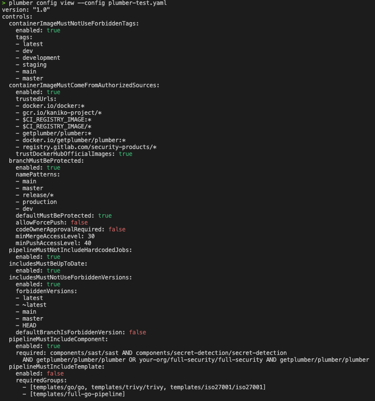
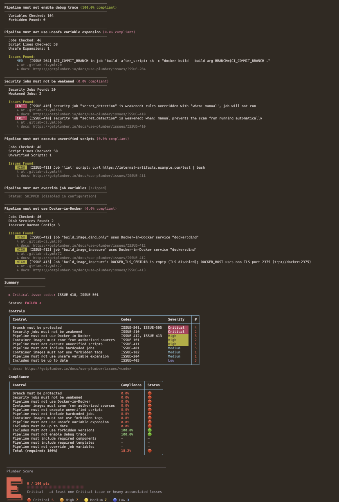
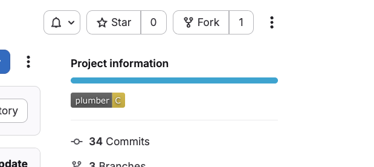

import { Icon } from "astro-icon/components";

The Plumber CLI analyzes **GitLab CI/CD pipelines** and **GitHub Actions workflows** from the command line, checking them against a single `.plumber.yaml` policy. Both providers share the same engine (OPA / Rego), the same output format, and the same exit codes — write a policy once, scan both.

**On GitLab**, Plumber flags issues like:
- Container images using mutable tags (`latest`, `dev`) or from untrusted registries
- Unprotected branches, missing approval rules, non-compliant MR settings
- Hardcoded jobs / outdated includes / forbidden version patterns (`main`, `HEAD`)
- Missing required catalog components or shared templates
- Security jobs weakened via `allow_failure`, `rules:` overrides, `when: manual`
- Controlled CI/CD variables overridden in the pipeline YAML
- Unverified remote script execution patterns (`curl | bash`, `wget | sh`)
- Docker-in-Docker (`dind`) services enabling container escape on shared runners

**On GitHub Actions**, Plumber flags issues like:
- Third-party actions not pinned by commit SHA — the tj-actions / reviewdog supply chain vector (CVE-2025-30066)
- Dangerous triggers (`pull_request_target`, `workflow_run`) that expose secrets to PR-author code
- Template injection via `${{ github.event.* }}` inlined into shell scripts
- Reusable workflows called with `secrets: inherit` instead of named-secret passing
- Implicit / over-broad `permissions:` blocks, missing environment gates on secrets
- Archived, impostor-SHA, or known-vulnerable action references (GHSA cross-reference)
- Dependabot misconfiguration (`insecure-external-code-execution: allow`, missing cooldown)

This is useful for local testing, CI/CD integration, security-team audits, or automated compliance checks across either platform.

<Button variant="outline" class="!border-base-900 dark:!border-base-100 hover:!border-primary-500/90 dark:hover:!border-primary-100/90" href="https://github.com/getplumber/plumber"><Icon name="tabler/brand-github" class="mr-2" />View on GitHub</Button>

## Installation

<Aside variant="info">
  Trying a beta? Homebrew, mise, and Docker Hub follow stable releases only. Beta binaries and checksums live on the [GitHub Releases page](https://github.com/getplumber/plumber/releases); each beta's release notes carry the verified download + checksum steps for that specific build.
</Aside>

<Tabs defaultValue="homebrew">
  <TabsList>
    <TabsTrigger value="homebrew">Homebrew</TabsTrigger>
    <TabsTrigger value="mise">Mise</TabsTrigger>
    <TabsTrigger value="binary">Binary</TabsTrigger>
    <TabsTrigger value="docker">Docker</TabsTrigger>
    <TabsTrigger value="source">Source</TabsTrigger>
  </TabsList>

  <TabsContent value="homebrew">
    ```bash
    brew tap getplumber/plumber
    brew install plumber
    ```

    **Install a specific version:**

    ```bash
    brew install getplumber/plumber/plumber@0.2.22
    ```

    <Aside variant="info">
      Versioned formulas are keg-only. Use the full path (e.g., `/usr/local/opt/plumber@0.2.22/bin/plumber`) or run `brew link plumber@0.2.22` to add it to your PATH.
    </Aside>
  </TabsContent>

  <TabsContent value="mise">
    ```bash
    mise use -g github:getplumber/plumber
    ```

    <Aside variant="info">
      Requires [mise activation](https://mise.jdx.dev/getting-started.html#activate-mise) in your shell, or run with `mise exec -- plumber`.
    </Aside>
  </TabsContent>

  <TabsContent value="binary">
    **Linux (amd64)**
    ```bash
    curl -LO https://github.com/getplumber/plumber/releases/latest/download/plumber-linux-amd64
    chmod +x plumber-linux-amd64
    sudo mv plumber-linux-amd64 /usr/local/bin/plumber
    ```

    **Linux (arm64)**
    ```bash
    curl -LO https://github.com/getplumber/plumber/releases/latest/download/plumber-linux-arm64
    chmod +x plumber-linux-arm64
    sudo mv plumber-linux-arm64 /usr/local/bin/plumber
    ```

    **macOS (Apple Silicon)**
    ```bash
    curl -LO https://github.com/getplumber/plumber/releases/latest/download/plumber-darwin-arm64
    chmod +x plumber-darwin-arm64
    sudo mv plumber-darwin-arm64 /usr/local/bin/plumber
    ```

    **macOS (Intel)**
    ```bash
    curl -LO https://github.com/getplumber/plumber/releases/latest/download/plumber-darwin-amd64
    chmod +x plumber-darwin-amd64
    sudo mv plumber-darwin-amd64 /usr/local/bin/plumber
    ```

    **Windows (PowerShell)**
    ```powershell
    Invoke-WebRequest -Uri https://github.com/getplumber/plumber/releases/latest/download/plumber-windows-amd64.exe -OutFile plumber.exe
    ```

    **Verify checksum** (optional):
    ```bash
    curl -LO https://github.com/getplumber/plumber/releases/latest/download/checksums.txt
    sha256sum -c checksums.txt --ignore-missing
    ```
  </TabsContent>

  <TabsContent value="docker">
    ```bash
    docker pull getplumber/plumber:latest
    ```

    Run analysis directly with Docker:

    ```bash
    docker run --rm \
      -e GITLAB_TOKEN=glpat-xxxx \
      getplumber/plumber:latest analyze \
      --gitlab-url https://gitlab.com \
      --project mygroup/myproject
    ```
  </TabsContent>

  <TabsContent value="source">
    ```bash
    git clone https://github.com/getplumber/plumber.git
    cd plumber
    make build
    # or: make install (builds and copies to /usr/local/bin/)
    ```

    <Aside variant="info">
      Requires Go 1.24+ and Make.
    </Aside>
  </TabsContent>
</Tabs>

## Quick Start

<Steps>
1. **Create a config file**

   Pick **one** of these (they produce different files on purpose):

   | Command | When to use | Output |
   |---------|-------------|--------|
   | [`plumber config generate`](#plumber-config-generate) | First-time setup, CI, or you want every control documented inline | Full default `.plumber.yaml` **with comments** (official template) |
   | [`plumber config init`](#plumber-config-init) | You want a **smaller** file and only selected checks (interactive terminal) | Minimal YAML: only controls you enable in the wizard |

   ```bash
   # Full commented template (same file Plumber ships as the default)
   plumber config generate

   # Or: interactive wizard → tailored minimal config (TTY required)
   plumber config init
   ```

   In CI or scripts, use **`plumber config generate`** (optionally `--output` / `--force`), then delete or disable controls you do not need. **`plumber config init`** requires an interactive terminal. See [Creating your configuration file](#creating-your-configuration-file) below.

2. **Create and set your provider token**

   <Tabs defaultValue="gitlab">
     <TabsList>
       <TabsTrigger value="gitlab">GitLab</TabsTrigger>
       <TabsTrigger value="github">GitHub</TabsTrigger>
     </TabsList>

     <TabsContent value="gitlab">
       In GitLab, go to **User Settings → Access Tokens** ([direct link](https://gitlab.com/-/user_settings/personal_access_tokens)) and create a Personal Access Token with `read_api` + `read_repository` scopes. **Project Access Tokens** also work: create one inside your project under **Settings → Access Tokens** with the same scopes and at least **Maintainer** role.

       <Aside variant="caution">
         The token must belong to a user (or project bot) with **Maintainer** role (or higher) on the project to access branch protection settings and other project configurations.
       </Aside>

       ```bash
       export GITLAB_TOKEN=glpat-xxxx
       ```
     </TabsContent>

     <TabsContent value="github">
       Pick whichever auth flow fits your environment:

       ```bash
       # Option 1: GitHub CLI (recommended for local use)
       gh auth login

       # Option 2: Fine-grained Personal Access Token
       # Settings > Developer settings > Personal access tokens > Fine-grained tokens
       #   Repository access: pick the repo(s) to scan
       #   Permissions: Contents = Read, Metadata = Read, Administration = Read
       export GH_TOKEN=github_pat_xxxx

       # Option 3: Classic PAT (broader scope, still works)
       # Permissions: `repo` scope (read access to repo + admin metadata)
       export GH_TOKEN=ghp_xxxx
       ```

       <Aside variant="caution">
         `Administration: Read` (fine-grained) or `repo` scope (classic) is needed for the `branchMustBeProtected` rule to evaluate force-push and code-owner-approval settings. Without it the rule abstains and Plumber reports the abstention explicitly in `partialControls` rather than claiming a false 100% pass.
       </Aside>

       <Aside variant="info">
         `branchMustBeProtected` reads both classic Branch Protection (Settings &gt; Branches) and Repository / Organization Rulesets (Settings &gt; Rules &gt; Rulesets). Rules from either mechanism are unioned, stricter wins. A code-owner-approval rule defined only in a Ruleset is honored.
       </Aside>

       When a token-scoped control cannot fully evaluate, Plumber adds a `partialControls` entry to `report.json` so CI gates can tell the difference between "100% compliant" and "100% on what we could see":

       ```json
       "partialControls": [
         {
           "control": "branchMustBeProtected",
           "reason": "Token lacks Administration:Read scope; force-push and code-owner-approval rules (ISSUE-505) not evaluated.",
           "affectedBranches": 1,
           "remediation": "Re-run with a token carrying Administration:Read (fine-grained PAT) or `repo` scope (classic PAT)."
         }
       ]
       ```

       When this array is non-empty, at least one control abstained on at least part of its input. Treat the run as suspect rather than trusting the compliance percentage. On a clean run the array is either omitted or empty.

       On GitHub Enterprise Server, pass the GHES host via `--github-url ghes.example.com`. Plumber auto-detects `github.com` from your git remote.
     </TabsContent>
   </Tabs>

3. **Run analysis**

   ```bash
   # GitLab — auto-detected from git remote
   plumber analyze

   # GitLab — explicit project
   plumber analyze --gitlab-url https://gitlab.com --project mygroup/myproject

   # GitHub Actions — local clone (auto-detected from git remote)
   plumber analyze

   # GitHub Actions — scan a repo without cloning it (upstream-fetch mode)
   plumber analyze --github-url github.com --project myorg/myrepo
   ```

   Plumber auto-detects the provider, URL and project from your git remote (`origin`). Override with `--gitlab-url --project` or `--github-url --project` when scanning a repo you haven't cloned.

4. **Review results**

   Plumber reads your `.plumber.yaml` config and outputs a compliance report. You can also store the output in JSON format with the `--output` flag.
</Steps>

## Command Reference

### `plumber analyze`

The main command for analyzing GitLab CI/CD pipelines.

```bash
plumber analyze [flags]
```

### Flags

| Flag | Required | Default | Description |
|------|----------|---------|-------------|
| `--gitlab-url` | No* | auto-detect | GitLab instance URL (e.g., `https://gitlab.com`). Mutually exclusive with `--github-url`. |
| `--github-url` | No* | auto-detect | GitHub host (e.g., `github.com` or `ghes.example.com`). Mutually exclusive with `--gitlab-url`. |
| `--project` | No* | auto-detect | Project / repo path. GitLab: `group/project`. GitHub: `owner/repo`. |
| `--config` | No | `.plumber.yaml` | Path to configuration file |
| `--threshold` | No | `100` | Minimum compliance % to pass (0-100) |
| `--branch` | No | Project default | Branch to analyze |
| `--output` | No | - | Write JSON results to file |
| `--pbom` | No | - | Write PBOM (Pipeline Bill of Materials) to file |
| `--pbom-cyclonedx` | No | - | Write PBOM in CycloneDX SBOM format |
| `--print` | No | `true` | Print text output to stdout |
| `--mr-comment` | No | `false` | Post/update a compliance comment on the merge request (MR pipelines only; requires `api` scope) |
| `--badge` | No | `false` | Create/update a Plumber compliance badge on the project (requires `api` scope; only runs on default branch) |
| `--controls` | No | - | Run only listed controls (comma-separated). Cannot be used with `--skip-controls` |
| `--skip-controls` | No | - | Skip listed controls (comma-separated). Cannot be used with `--controls` |
| `--fail-warnings` | No | `false` | Treat configuration warnings (unknown keys) as errors (exit 2) |
| `--ci-config-path` | No | auto-detect | Override CI configuration file path. Defaults to project CI config path from GitLab settings (usually `.gitlab-ci.yml`) |
| `--verbose`, `-v` | No | `false` | Enable verbose/debug output |

<Aside variant="info">
  \* Auto-detected from git remote (requires `origin`) if not specified. Supports both SSH and HTTPS remote URLs.  
  \* You can always override with `--gitlab-url` and `--project`
</Aside>

### Environment Variables

| Variable | Required | Description |
|----------|----------|-------------|
| `GITLAB_TOKEN` | GitLab only | GitLab API token with `read_api` + `read_repository` scopes (from a Maintainer or higher). Use `api` scope instead if `--mr-comment` or `--badge` is enabled. |
| `GH_TOKEN` / `GITHUB_TOKEN` | GitHub only | GitHub API token. Fine-grained PAT needs `Contents: Read`, `Metadata: Read`, `Administration: Read`. Classic PAT needs `repo`. Alternatively, run `gh auth login` and Plumber will pick up the gh CLI credential. |
| `PLUMBER_NO_UPDATE_CHECK` | No | Set to any value (e.g., `1`) to disable the automatic version check. |

### Automatic Version Check

When running locally, Plumber checks GitHub for newer releases on every invocation and prints an upgrade notice if one is available. The check runs asynchronously and has a 3-second timeout, so it never slows down the analysis.

The check is **automatically skipped** when:
- Running in **CI environments** (`CI` or `GITLAB_CI` environment variables are set)
- Using a **development build** (version is `dev`)

To disable it manually:

```bash
export PLUMBER_NO_UPDATE_CHECK=1
```

### Exit Codes

| Code | Meaning |
|------|---------|
| `0` | Passed (compliance ≥ threshold) |
| `1` | Compliance failure (compliance < threshold) |
| `2` | Runtime error (config error, network failure, missing token, etc.) |

### `plumber config init`

Interactive wizard to create a **minimal** `.plumber.yaml`: pick policy areas (container images, pipeline composition, branch protection, variables) and only those controls are written. For each selected area, prompts cover the tunable fields in the schema (lists, booleans, GitLab access levels, `required` expressions for catalog components and file templates, and so on).

**Requires an interactive terminal** (TTY). In CI or Docker without a TTY, use [`plumber config generate`](#plumber-config-generate) instead and edit the file.

**Contrast:** [`plumber config generate`](#plumber-config-generate) always writes the **full** default template **with comments**; `init` writes a **short** file shaped by your answers.

```bash
plumber config init [flags]
```

| Flag | Default | Description |
|------|---------|-------------|
| `--output`, `-o` | `.plumber.yaml` | Output file path |
| `--force`, `-f` | `false` | Overwrite existing file without asking |

**Examples:**

```bash
plumber config init
plumber config init -o configs/plumber.yaml
```

### `plumber config generate`

Writes the **official default** `.plumber.yaml`: the full template Plumber ships with, including comments and every control documented inline. Safe for **scripts and CI** (no prompts). Use [`plumber config init`](#plumber-config-init) when you have a TTY and want a **smaller** file with only the checks you pick.

```bash
plumber config generate [flags]
```

| Flag | Default | Description |
|------|---------|-------------|
| `--output`, `-o` | `.plumber.yaml` | Output file path |
| `--force`, `-f` | `false` | Overwrite existing file |

**Examples:**

```bash
plumber config generate
plumber config generate --output my-plumber.yaml
plumber config generate --force
```

### `plumber config migrate`

Upgrades a `.plumber.yaml` from schema v1 (top-level `controls:`) to schema v2 (per-provider `gitlab.controls:` / `github.controls:`). Comments and YAML anchors are preserved. The migration is idempotent: running it against a file already on v2 is a no-op with a friendly exit message.

By default the tool writes a sibling `.plumber.yaml.v2` so you can diff before swapping. Pass `--in-place` to overwrite the original; the previous file is backed up to `.plumber.yaml.bak`.

```bash
plumber config migrate [flags]
```

| Flag | Default | Description |
|------|---------|-------------|
| `--config`, `-c` | `.plumber.yaml` | Source file to read |
| `--in-place` | `false` | Overwrite the source. Original is preserved as `.plumber.yaml.bak`. |

**Examples:**

```bash
# Write a sibling .plumber.yaml.v2; diff before swapping.
plumber config migrate
diff .plumber.yaml .plumber.yaml.v2
mv .plumber.yaml.v2 .plumber.yaml

# Or migrate in place, with backup.
plumber config migrate --in-place
```

<Aside variant="info">
  Plumber still loads v1 files in the current release; the loader auto-converts them in memory and emits a one-line deprecation warning each run. v1 support will be removed in 1.0.0, so migrating is the safe path before that release.
</Aside>

### `plumber config view`

Display a clean, human-readable view of the effective configuration without comments.

```bash
plumber config view [flags]
```

| Flag | Default | Description |
|------|---------|-------------|
| `--config`, `-c` | `.plumber.yaml` | Path to configuration file |
| `--no-color` | `false` | Disable colorized output |

Booleans are colorized for quick scanning: `true` in green, `false` in red. Color is automatically disabled when piping output.

<div style={{maxWidth: '400px'}}>



</div>

**Examples:**

```bash
# View the default .plumber.yaml
plumber config view

# View a specific config file
plumber config view --config custom-plumber.yaml

# View without colors (for piping or scripts)
plumber config view --no-color
```

### `plumber config validate`

Validate a configuration file for correctness. Detects unknown control names and sub-keys with typo suggestions using fuzzy matching.

```bash
plumber config validate [flags]
```

| Flag | Default | Description |
|------|---------|-------------|
| `--config`, `-c` | `.plumber.yaml` | Path to configuration file |
| `--fail-warnings` | `false` | Treat configuration warnings as errors (exit 2) |

Warnings are printed to stderr so they don't interfere with scripted output. Use `--fail-warnings` to exit with code 2 when warnings are found (useful in CI).

**Examples:**

```bash
# Validate the default .plumber.yaml
plumber config validate

# Validate a specific config file
plumber config validate --config custom-plumber.yaml

# Fail on warnings (for CI pipelines)
plumber config validate --fail-warnings
```

**Sample output with typos:**

```
Configuration validation warnings:
  - Unknown control in .plumber.yaml: "containerImageMustNotUseForbiddenTag". Did you mean "containerImageMustNotUseForbiddenTags"?
  - Unknown key "tag" in control "containerImageMustNotUseForbiddenTags". Did you mean "tags"?
  - Unknown key "allowForcePushes" in control "branchMustBeProtected". Did you mean "allowForcePush"?
```

### `plumber explain`

Look up detailed information for an issue code directly from the terminal.

```bash
plumber explain [ISSUE-CODE] [flags]
```

`ISSUE-CODE` supports both full and shorthand forms:
- `ISSUE-412`
- `412`

```bash
plumber explain ISSUE-412
plumber explain 412
plumber explain --list
```

**Sample output** (`plumber explain ISSUE-412`):

```
ISSUE-412: Docker-in-Docker service detected
Control:     pipelineMustNotUseDockerInDocker

Description:
  A CI/CD job uses a Docker-in-Docker (dind) service. On shared runners
  running in privileged mode, this enables container escape, lateral
  movement, and access to secrets from other jobs on the same runner.

Remediation:
  Replace Docker-in-Docker with a safer alternative such as Kaniko or
  Buildah for building container images. These tools do not require
  privileged mode and avoid the security risks of running a Docker daemon
  inside a CI container.

Documentation: https://getplumber.io/docs/use-plumber/issues/ISSUE-412
```

## Usage Examples

### Save JSON Output

```bash
docker run --rm \
  -e GITLAB_TOKEN=glpat-xxxx \
  -v $(pwd):/output \
  getplumber/plumber:latest analyze \
  --gitlab-url https://gitlab.com \
  --project mygroup/myproject \
  --branch main \
  --config /.plumber.yaml \
  --threshold 100 \
  --output /output/results.json
```

### Self-Hosted GitLab

```bash
plumber analyze \
  --gitlab-url https://gitlab.example.com \
  --project mygroup/myproject \
  --branch develop \
  --config .plumber.yaml \
  --threshold 80
```

### Custom CI Configuration Path

Use this when your project defines a custom CI/CD configuration file path in GitLab:

```bash
plumber analyze \
  --gitlab-url https://gitlab.com \
  --project mygroup/myproject \
  --ci-config-path .gitlab/ci/main.yml
```

### Silent Mode (JSON Only)

```bash
plumber analyze \
  --gitlab-url https://gitlab.com \
  --project mygroup/myproject \
  --config .plumber.yaml \
  --threshold 100 \
  --output results.json \
  --print false
```

## Example Output

The CLI output is color-coded in your terminal for easy scanning — green for passing controls, red for failures.

<Aside variant="tip">
  When using `--output`, results are saved as JSON for programmatic access and CI/CD integration.
</Aside>

{/* TODO: refresh screenshot. The CLI now banners "GitLab & GitHub Actions" and prints a "Points breakdown (beta)" block. See release-announcement-0.3.0-beta.md for the current output shape. */}


## Pipeline Bill of Materials (PBOM) & CycloneDX

Plumber can generate a **PBOM** — a complete inventory of all dependencies in your CI/CD pipeline (container images, components, templates, includes). Two formats are available:

**Native PBOM** (detailed, pipeline-specific):

```bash
plumber analyze --pbom pbom.json
```

**CycloneDX SBOM** (standard format for security tool integration):

```bash
plumber analyze --pbom-cyclonedx pipeline-sbom.json
```

The CycloneDX output follows the [CycloneDX 1.5 specification](https://cyclonedx.org/docs/1.5/json/) and is compatible with tools like Grype, Trivy, and Dependency-Track. When using the [GitLab CI component](/docs/cli/gitlab-component/), the CycloneDX file is automatically uploaded as a [GitLab CycloneDX report](https://docs.gitlab.com/ci/yaml/artifacts_reports/#artifactsreportscyclonedx).

<Aside variant="info">
  CI/CD components and templates do not have CVEs in public vulnerability databases. The PBOM is primarily an **inventory and compliance tool** — it tells you *what's in your pipeline*, not whether those items have known vulnerabilities. For image vulnerability scanning, use `trivy image` or `grype` directly on the images.
</Aside>


## Output JSON shape

`plumber analyze --output report.json` writes a single JSON object. The keys below are stable for scripting; additional keys may be added in minor versions, existing keys will not be renamed or removed.

**Top-level keys**

| Key | Type | Description |
|-----|------|-------------|
| `projectPath` | string | Path identifying the analyzed project (e.g. `group/project` on GitLab, `owner/repo` on GitHub). |
| `projectId` | number | Provider-side project / repo id, when known. |
| `defaultBranch` | string | Default branch reported by the provider. |
| `ciConfigSource` | string | Source of the CI configuration (e.g. `.gitlab-ci.yml`, `.github/workflows/`). |
| `ciValid` | boolean | Whether the CI configuration parsed successfully. |
| `ciMissing` | boolean | True when no CI configuration file was found. |
| `pipelineOriginMetrics` | object | Counts and origins of pipeline jobs (hardcoded, from include, from component). |
| `pipelineImageMetrics` | object | Counts of container images per source / registry. |
| `compliance` | number | Effective compliance percentage (0–100). |
| `threshold` | number | Threshold from `--threshold` (default 100). |
| `passed` | boolean | True when `compliance >= threshold`. |
| `plumberScore` | object | Scored severity summary (raw points, severity buckets, final points). |
| `partialControls` | array | Controls that could not fully evaluate. Empty or omitted on a clean run. |
| `<control>Result` | object | One entry per evaluated control (see below). |

**Per-control `*Result` block**

Each `*Result` block has the same baseline shape. Some controls add a few control-specific keys on top.

| Key | Type | Description |
|-----|------|-------------|
| `issues` | array | Findings raised by the control. Each entry carries an `ISSUE-XXX` code, severity, location, and message. |
| `metrics` | object | Counts the control collected (jobs scanned, images checked, branches inspected, etc.). |
| `compliance` | number | Per-control compliance percentage. |
| `skipped` | boolean | True when the control was disabled in `.plumber.yaml` or excluded via `--skip-controls`. |
| `ciValid` | boolean | Same as the top-level field, scoped to what this control needed. |
| `ciMissing` | boolean | Same as the top-level field, scoped to what this control needed. |
| `version` | string | Schema version of the control's output block. |

**`partialControls` entry**

When non-empty, each entry has the shape shown in the [GitHub auth section](#quick-start) above: `control`, `reason`, `affectedBranches` (when relevant), `remediation`. CI gates should fail loud when this array contains anything, even if `compliance` reads 100.

<Aside variant="info">
  Stability: keys documented above are stable across 0.3.x minor versions. New keys may be added without notice. Existing keys will not be renamed or removed without a major-version bump.
</Aside>


## Configuration

Plumber uses a `.plumber.yaml` configuration file to customize checks.

### Creating your configuration file

There are two supported ways to create a new file:

- **`plumber config generate`** writes the **official default template**: long-form YAML with **comments** explaining every control. Use this when you want the full reference in the repo (typical first commit, or automation that should not depend on a TTY).
- **`plumber config init`** runs an **interactive wizard** and writes a **minimal** `.plumber.yaml` containing only the policy areas and options you choose. It requires a normal interactive terminal (not suitable for headless CI).

After the file exists, use **`plumber config validate`** to check for typos, **`plumber config view`** to see the effective settings without comments, and **`plumber config diff`** to compare your file to the embedded default.

### Available Controls

Plumber includes compliance controls covering CI/CD configuration, repository settings, and access management. Each can be enabled/disabled and customized.
When a control detects a violation, it creates an **Issue** (e.g., `ISSUE-101`) with a direct link to its documentation page.

| Control | Issues | Description |
|---------|--------|-------------|
| **Container images must not use forbidden tags** | [ISSUE-102](/docs/use-plumber/issues/ISSUE-102) | Flags `latest`, `dev`, and other mutable tags. Can enforce digest pinning for all images |
| **Container images must be pinned by digest** | [ISSUE-103](/docs/use-plumber/issues/ISSUE-103) | Ensures images use SHA256 digest pinning |
| **Container images must come from authorized sources** | [ISSUE-101](/docs/use-plumber/issues/ISSUE-101) | Ensures images come from trusted registries |
| **Branch must be protected** | [ISSUE-501](/docs/use-plumber/issues/ISSUE-501) [ISSUE-505](/docs/use-plumber/issues/ISSUE-505) | Verifies critical branches have proper protection |
| **Pipeline must not include hardcoded jobs** | [ISSUE-401](/docs/use-plumber/issues/ISSUE-401) | Detects jobs defined directly instead of from includes |
| **Includes must be up to date** | [ISSUE-403](/docs/use-plumber/issues/ISSUE-403) | Checks if included templates have newer versions |
| **Includes must not use forbidden versions** | [ISSUE-404](/docs/use-plumber/issues/ISSUE-404) | Prevents mutable version references like `main`, `HEAD` |
| **Pipeline must include component** | [ISSUE-408](/docs/use-plumber/issues/ISSUE-408) [ISSUE-409](/docs/use-plumber/issues/ISSUE-409) | Ensures required CI/CD components are included; detects overridden jobs |
| **Pipeline must include template** | [ISSUE-405](/docs/use-plumber/issues/ISSUE-405) [ISSUE-406](/docs/use-plumber/issues/ISSUE-406) | Ensures required templates are included; detects overridden jobs |
| **Pipeline must not enable debug trace** | [ISSUE-203](/docs/use-plumber/issues/ISSUE-203) | Detects `CI_DEBUG_TRACE`/`CI_DEBUG_SERVICES` leaking secrets in job logs |
| **Pipeline must not use unsafe variable expansion** | [ISSUE-204](/docs/use-plumber/issues/ISSUE-204) | Detects user-controlled variables in shell re-interpretation contexts (OWASP CICD-SEC-1) |
| **Security jobs must not be weakened** | [ISSUE-410](/docs/use-plumber/issues/ISSUE-410) | Detects security scanning jobs neutralized by `allow_failure`, `rules:` overrides, or `when: manual` (OWASP CICD-SEC-4) |
| **Pipeline must not override job variables** | [ISSUE-205](/docs/use-plumber/issues/ISSUE-205) | Detects controlled CI/CD variables redefined in `.gitlab-ci.yml` that should only be set in GitLab CI/CD Settings |
| **Pipeline must not execute unverified scripts** | [ISSUE-411](/docs/use-plumber/issues/ISSUE-411) | Detects `curl \| bash`, `wget \| sh`, and download-then-execute patterns without integrity verification (OWASP CICD-SEC-3) |
| **Pipeline must not use Docker-in-Docker** | [ISSUE-412](/docs/use-plumber/issues/ISSUE-412) [ISSUE-413](/docs/use-plumber/issues/ISSUE-413) | Detects `docker:dind` services and insecure Docker daemon configuration (for example TLS disabled) |

<details>
<summary>**Unsafe Variable Expansion Detection**</summary>

Detects user-controlled CI variables (MR title, commit message, branch name) passed to commands that re-interpret their input as shell code. This is [OWASP CICD-SEC-1](https://owasp.org/www-project-top-10-ci-cd-security-risks/).

GitLab sets CI variables as environment variables. The shell does **not** re-parse expanded values for command substitution, so normal usage is safe. Only commands that re-interpret their arguments as code are flagged:

**Flagged** (re-interpretation contexts):

```bash
eval "$CI_COMMIT_BRANCH"
sh -c "$CI_MERGE_REQUEST_TITLE"
bash -c "$CI_COMMIT_MESSAGE"
source <(echo "$CI_COMMIT_REF_NAME")
echo "$CI_COMMIT_BRANCH" | xargs sh
```

**Not flagged** (safe, the shell doesn't re-parse env var values):

```bash
echo $CI_COMMIT_BRANCH
curl -d "$CI_MERGE_REQUEST_TITLE" https://...
git checkout $CI_COMMIT_REF_NAME
printf '%s' "$CI_COMMIT_MESSAGE"
```

**Allowing specific patterns**

Some `sh -c` or `bash -c` usages are legitimate (e.g., Helm deploys, Terraform workspaces). Use `allowedPatterns` (regex) to suppress those findings. Each pattern is matched against the full script line.

```yaml
pipelineMustNotUseUnsafeVariableExpansion:
  enabled: true
  dangerousVariables:
    - CI_MERGE_REQUEST_TITLE
    - CI_COMMIT_MESSAGE
    - CI_COMMIT_REF_NAME
    - CI_COMMIT_REF_SLUG
    - CI_COMMIT_BRANCH
  allowedPatterns:
    - "helm.*--set.*\\$CI_"
    - "terraform workspace select.*\\$CI_"
    - "docker build.*--build-arg.*\\$CI_"
    - "aws s3 sync.*\\$CI_"
    - "make deploy.*\\$CI_"
```

For example, the script line `sh -c "helm upgrade myapp . --set image.tag=$CI_COMMIT_SHA"` would normally be flagged, but the pattern `helm.*--set.*\\$CI_` allows it.

<Aside variant="info">
  Escape `$` as `\\$` and `{`/`}` as `\\{`/`\\}` in patterns. Only direct variable names are detected. Indirect aliasing (`variables: { B: $CI_COMMIT_BRANCH }` then `sh -c $B`) is not tracked.
</Aside>

</details>

<details>
<summary>**Security Job Weakening Detection**</summary>

GitLab lets you override any property of an included job. This means someone can include a security template (SAST, Secret Detection, Container Scanning, Dependency Scanning, DAST, License Scanning) but silently neutralize it. The pipeline still looks compliant, but the scanning is disabled. Maps to [OWASP CICD-SEC-4](https://owasp.org/www-project-top-10-ci-cd-security-risks/) (Poisoned Pipeline Execution).

This control detects three weakening patterns, each a separate sub-control you can toggle independently:

- **`allowFailureMustBeFalse`** (default: off, opt-in): Detects `allow_failure: true`. Off by default because GitLab templates ship with this setting.
- **`rulesMustNotBeRedefined`** (default: on): Detects `rules:` overrides with `when: never` or `when: manual`.
- **`whenMustNotBeManual`** (default: on): Detects `when: manual` set at job level.

**Flagged: security jobs weakened**

```yaml
include:
  - template: Security/SAST.gitlab-ci.yml

semgrep-sast:
  allow_failure: true       # failures silently ignored

secret_detection:
  rules:
    - when: never            # job will never run

container_scanning:
  when: manual               # requires manual trigger
```

**Configuration**

Plumber identifies a job as a security job when its name matches one of the globs listed under `securityJobPatterns`. Wildcards (`*`) match any substring.

The name Plumber matches against depends on the provider:

- **GitLab**: the job id as it appears in `.gitlab-ci.yml` (for example `semgrep-sast`).
- **GitHub**: `<workflow-file-basename-without-.yml>/<job-id>` (for example `codeql-analysis/analyze` for `.github/workflows/codeql-analysis.yml` + `jobs.analyze`). The `<workflow>/` prefix exists so two workflow files defining a job with the same id never collide.

Four useful pattern shapes (the `<workflow>/...` shapes are GitHub-only since GitLab has no workflow namespace):

| Pattern | Matches | When to use |
|---|---|---|
| `*<token>*` | The token anywhere in the name | You don't know which workflow file will host the job |
| `<workflow>/*` | Every job in one workflow file | All security jobs live in `security.yml` |
| `*/<jobid>` | Specific job id in any workflow | Job id is canonical (e.g. `codeql`) but file location varies |
| `<workflow>/<jobid>` | Exact match, no wildcard | You control both names and want strict matching |

The defaults ship wildcard-wrapped because Plumber doesn't know your repo's workflow-file convention. A bare `codeql` would only match a job whose full name is exactly `codeql`, which on GitHub is impossible (every job carries the `<workflow>/` prefix). The wildcards trade precision for resilience. If you control your layout, drop the wildcards for a tighter match.

**GitLab example**

```yaml
gitlab:
  controls:
    securityJobsMustNotBeWeakened:
      enabled: true
      securityJobPatterns:
        - "*-sast"
        - "secret_detection"
        - "container_scanning"
        - "*_dependency_scanning"
        - "gemnasium-*"
        - "dast"
        - "dast_*"
        - "license_scanning"
      allowFailureMustBeFalse:
        enabled: false
      rulesMustNotBeRedefined:
        enabled: true
      whenMustNotBeManual:
        enabled: true
```

**GitHub example**

```yaml
github:
  controls:
    securityJobsMustNotBeWeakened:
      enabled: true
      securityJobPatterns:
        - "*codeql*"
        - "*dependency-review*"
        - "*trufflehog*"
        - "*gitleaks*"
        - "*osv-scanner*"
        - "*-sast"
        - "*-sast-*"
        - "*-scan"
        - "*scan*"
        - "*-security"
        - "*-security-*"
        - "*-audit"
        - "*-audit-*"
        # Real-world slash-form examples (commented; uncomment and
        # adapt to your repo for a tighter match than the wildcards
        # above). Format: <workflow-filename-without-extension>/<job-id>.
        # - codeql-analysis/analyze              # GitHub's default CodeQL template
        # - dependency-review/dependency-review  # GitHub's default Dependency Review template
        # - security/gitleaks                    # gitleaks job in security.yml
        # - security/trufflehog                  # trufflehog job in security.yml
        # - security/*                           # every job in security.yml
        # - "*/sast"                             # any job named "sast", any workflow
        # - ci/semgrep-sast                      # exact match, no wildcard
      allowFailureMustBeFalse:
        enabled: true
      rulesMustNotBeRedefined:
        enabled: true
      whenMustNotBeManual:
        enabled: true
```

</details>

<details>
<summary>**Unverified Script Execution Detection**</summary>

Detects CI/CD jobs that download and immediately execute scripts from the internet without integrity verification. This is a well-documented supply chain attack vector: an attacker who compromises the remote URL can serve a modified script that exfiltrates secrets. Maps to [OWASP CICD-SEC-3](https://owasp.org/www-project-top-10-ci-cd-security-risks/) (Dependency Chain Abuse) and CICD-SEC-8 (Ungoverned Usage of 3rd Party Services).

**Detected patterns:**
- Direct pipe to shell: `curl ... | bash`, `wget ... | sh`, `curl ... | python`, etc.
- Download-and-execute: `curl -o script.sh ... && bash script.sh`
- Download-redirect-execute: `curl ... > install.sh; sh install.sh`

Lines that include checksum verification (e.g., `sha256sum`, `gpg --verify`) between the download and execution are automatically excluded.

**Configuration:**

```yaml
pipelineMustNotExecuteUnverifiedScripts:
  enabled: true
  trustedUrls: []
    # - https://internal-artifacts.example.com/*
```

Add trusted URL patterns to `trustedUrls` (supports wildcards) to suppress findings for known-good sources.

</details>

<details>
<summary>**Job Variable Override Detection**</summary>

Detects CI/CD variables that are redefined in the pipeline configuration file (`.gitlab-ci.yml`) when they should only be set in **GitLab CI/CD Settings > Variables**. An attacker who can modify `.gitlab-ci.yml` could override variables like `SECURE_ANALYZERS_PREFIX` to point to a fake registry, or set `SAST_DISABLED: "true"` to silently disable security scanners.

The control inspects only the raw user-authored YAML. Variables defined by included templates or components are not flagged.

**Configuration:**

```yaml
pipelineMustNotOverrideJobVariables:
  enabled: true
  variables:
    - SECURE_ANALYZERS_PREFIX
    - SAST_DISABLED
    - SAST_EXCLUDED_PATHS
    - SAST_EXCLUDED_ANALYZERS
    - SECRET_DETECTION_DISABLED
    - SECRET_DETECTION_EXCLUDED_PATHS
    - CONTAINER_SCANNING_DISABLED
    - DAST_DISABLED
    - DEPENDENCY_SCANNING_DISABLED
    - LICENSE_SCANNING_DISABLED
```

Add any variable name your organization considers controlled. Matching is case-insensitive and any value triggers the issue (even `"false"`).

</details>

<details>
<summary>**Docker-in-Docker Detection**</summary>

Detects CI/CD jobs that use Docker-in-Docker (dind) services. Running a Docker daemon inside a CI container on shared runners in privileged mode enables container escape, lateral movement, and access to secrets from other jobs on the same runner.

When `detectInsecureDaemon` is enabled (default: true), the control also flags jobs where TLS is disabled (`DOCKER_TLS_CERTDIR=""`) or the Docker host uses the plaintext port (`tcp://docker:2375`).

**Configuration:**

```yaml
pipelineMustNotUseDockerInDocker:
  enabled: true
  detectInsecureDaemon: true
```

Consider using [Kaniko](https://github.com/GoogleContainerTools/kaniko) or [Buildah](https://github.com/containers/buildah) for building container images in CI/CD as safer alternatives.

</details>

### Issues

The Open Source CLI reports **Issues** using identifiers like `ISSUE-XXXX`. Each links to a documentation page with:

- **Description** of the problem
- **Impact** on your security posture
- **How to fix** with before/after configuration examples
- **Tips** for best practices

These IDs appear in CLI output, MR comments, and summary tables. Click any issue below for full detail. [Compliance Controls](/docs/use-plumber/controls) and the [Issues](/docs/use-plumber/issues) index also list **Platform**-only findings that the CLI does not emit.

You can also inspect a code locally from the CLI:

```bash
plumber explain ISSUE-412
# shorthand:
plumber explain 412
```

Codes shipping today are listed below per provider. The full catalog including roadmap controls is on the [Compliance Controls](/docs/use-plumber/controls) page.

<Tabs defaultValue="gitlab">
  <TabsList>
    <TabsTrigger value="gitlab">GitLab</TabsTrigger>
    <TabsTrigger value="github">GitHub</TabsTrigger>
  </TabsList>

  <TabsContent value="gitlab">
  | Issue | Title |
  |-------|-------|
  | [ISSUE-101](/docs/use-plumber/issues/ISSUE-101?p=gitlab) | Untrusted image source |
  | [ISSUE-102](/docs/use-plumber/issues/ISSUE-102?p=gitlab) | Forbidden container image tag |
  | [ISSUE-103](/docs/use-plumber/issues/ISSUE-103?p=gitlab) | Container image not pinned by digest |
  | [ISSUE-203](/docs/use-plumber/issues/ISSUE-203?p=gitlab) | Pipeline enables CI debug trace |
  | [ISSUE-204](/docs/use-plumber/issues/ISSUE-204?p=gitlab) | Unsafe variable expansion |
  | [ISSUE-205](/docs/use-plumber/issues/ISSUE-205?p=gitlab) | Job variable overrides controlled variable |
  | [ISSUE-401](/docs/use-plumber/issues/ISSUE-401?p=gitlab) | Hardcoded job |
  | [ISSUE-403](/docs/use-plumber/issues/ISSUE-403?p=gitlab) | Outdated template |
  | [ISSUE-404](/docs/use-plumber/issues/ISSUE-404?p=gitlab) | Forbidden include version |
  | [ISSUE-405](/docs/use-plumber/issues/ISSUE-405?p=gitlab) | Missing required template |
  | [ISSUE-406](/docs/use-plumber/issues/ISSUE-406?p=gitlab) | Forbidden override of required template |
  | [ISSUE-408](/docs/use-plumber/issues/ISSUE-408?p=gitlab) | Missing required component |
  | [ISSUE-409](/docs/use-plumber/issues/ISSUE-409?p=gitlab) | Forbidden override of required component |
  | [ISSUE-410](/docs/use-plumber/issues/ISSUE-410?p=gitlab) | Security job weakened |
  | [ISSUE-411](/docs/use-plumber/issues/ISSUE-411?p=gitlab) | Unverified script execution |
  | [ISSUE-412](/docs/use-plumber/issues/ISSUE-412?p=gitlab) | Docker-in-Docker service detected |
  | [ISSUE-413](/docs/use-plumber/issues/ISSUE-413?p=gitlab) | Docker-in-Docker with insecure daemon configuration |
  | [ISSUE-501](/docs/use-plumber/issues/ISSUE-501?p=gitlab) | Branch protection missing |
  | [ISSUE-505](/docs/use-plumber/issues/ISSUE-505?p=gitlab) | Branch protection configuration not compliant |
  </TabsContent>

  <TabsContent value="github">
  | Issue | Title |
  |-------|-------|
  | [ISSUE-102](/docs/use-plumber/issues/ISSUE-102?p=github) | Forbidden container image tag |
  | [ISSUE-103](/docs/use-plumber/issues/ISSUE-103?p=github) | Container image not pinned by digest (sub-option of ISSUE-102) |
  | [ISSUE-104](/docs/use-plumber/issues/ISSUE-104?p=github) | Third-party action not pinned by commit SHA |
  | [ISSUE-206](/docs/use-plumber/issues/ISSUE-206?p=github) | Workflow inlines user input into shell scripts |
  | [ISSUE-302](/docs/use-plumber/issues/ISSUE-302?p=github) | Reusable workflow called with `secrets: inherit` |
  | [ISSUE-304](/docs/use-plumber/issues/ISSUE-304?p=github) | Workflow permissions not declared |
  | [ISSUE-410](/docs/use-plumber/issues/ISSUE-410?p=github) | Security job weakened |
  | [ISSUE-412](/docs/use-plumber/issues/ISSUE-412?p=github) | Docker-in-Docker service detected |
  | [ISSUE-413](/docs/use-plumber/issues/ISSUE-413?p=github) | Docker-in-Docker with insecure daemon configuration |
  | [ISSUE-414](/docs/use-plumber/issues/ISSUE-414?p=github) | Workflow uses a dangerous trigger |
  | [ISSUE-416](/docs/use-plumber/issues/ISSUE-416?p=github) | Required action or reusable workflow is missing |
  | [ISSUE-501](/docs/use-plumber/issues/ISSUE-501?p=github) | Branch protection missing |
  | [ISSUE-505](/docs/use-plumber/issues/ISSUE-505?p=github) | Branch protection configuration not compliant |

  Other GitHub control codes (action archival / impostor SHA / template injection sub-rules / dependabot hygiene / workflow obfuscation / etc.) have Rego policies in the engine but are not yet user-facing in this release. They appear in the [Compliance Controls](/docs/use-plumber/controls) page under "On the roadmap" so you can see what is coming.
  </TabsContent>
</Tabs>

### Example Configuration

<Aside variant="tip">
   See the [full configuration reference](https://github.com/getplumber/plumber/blob/main/.plumber.yaml) for all options.
</Aside>

The current schema (v2) splits controls into per-provider sections (`gitlab.controls:` / `github.controls:`). Legacy v1 files (flat `controls:`) still load with a deprecation warning; upgrade with [`plumber config migrate`](#plumber-config-migrate).

<Tabs defaultValue="v2">
  <TabsList>
    <TabsTrigger value="v2">v2 (current)</TabsTrigger>
    <TabsTrigger value="v1">v1 (legacy)</TabsTrigger>
  </TabsList>

  <TabsContent value="v2">
  ```yaml
  version: "2.0"

  gitlab:
    controls:
      containerImageMustNotUseForbiddenTags:
        enabled: true
        tags:
          - latest
          - dev
          - main
        # When true, ALL images must be pinned by digest. Takes precedence
        # over the tags list, so even version tags like alpine:3.19 fail.
        containerImagesMustBePinnedByDigest: false

      containerImageMustComeFromAuthorizedSources:
        enabled: true
        trustDockerHubOfficialImages: true
        trustedUrls:
          - $CI_REGISTRY_IMAGE:*
          - registry.gitlab.com/security-products/*

      branchMustBeProtected:
        enabled: true
        defaultMustBeProtected: true
        namePatterns:
          - main
          - release/*
        allowForcePush: false
        minMergeAccessLevel: 30   # Developer
        minPushAccessLevel: 40    # Maintainer

      pipelineMustNotIncludeHardcodedJobs:
        enabled: true

      includesMustBeUpToDate:
        enabled: true

      includesMustNotUseForbiddenVersions:
        enabled: true
        forbiddenVersions:
          - latest
          - "~latest"
          - main
          - master
          - HEAD
        defaultBranchIsForbiddenVersion: false

      pipelineMustIncludeComponent:
        enabled: false  # Disabled by default. Enable and configure for your org.
        # Expression syntax (use one, not both):
        # required: components/sast/sast AND components/secret-detection/secret-detection
        # Array syntax (OR of ANDs):
        # requiredGroups:
        #   - ["components/sast/sast", "components/secret-detection/secret-detection"]
        #   - ["your-org/full-security/full-security"]

      pipelineMustIncludeTemplate:
        enabled: false  # Disabled by default. Enable and configure for your org.
        # Expression syntax (use one, not both):
        # required: templates/go/go AND templates/trivy/trivy
        # Array syntax (OR of ANDs):
        # requiredGroups:
        #   - ["templates/go/go", "templates/trivy/trivy"]
        #   - ["templates/full-go-pipeline"]

      # Detect debug trace variables that leak secrets in job logs.
      pipelineMustNotEnableDebugTrace:
        enabled: true
        forbiddenVariables:
          - CI_DEBUG_TRACE
          - CI_DEBUG_SERVICES

      # Detect user-controlled variables in shell re-interpretation contexts
      # (eval, sh -c, etc.). Safe: echo $CI_COMMIT_BRANCH. Dangerous: eval
      # "deploy $CI_COMMIT_BRANCH".
      pipelineMustNotUseUnsafeVariableExpansion:
        enabled: true
        dangerousVariables:
          - CI_MERGE_REQUEST_TITLE
          - CI_MERGE_REQUEST_DESCRIPTION
          - CI_COMMIT_MESSAGE
          - CI_COMMIT_TITLE
          - CI_COMMIT_TAG_MESSAGE
          - CI_COMMIT_REF_NAME
          - CI_COMMIT_REF_SLUG
          - CI_COMMIT_BRANCH
          - CI_MERGE_REQUEST_SOURCE_BRANCH_NAME
          - CI_EXTERNAL_PULL_REQUEST_SOURCE_BRANCH_NAME
        # Regex patterns to allow specific script lines (escape $ as \\$).
        allowedPatterns:
          - "helm.*--set.*\\$CI_"
          - "terraform workspace select.*\\$CI_"
          - "docker build.*--build-arg.*\\$CI_"

      # Detect security scanning jobs that have been silently weakened.
      securityJobsMustNotBeWeakened:
        enabled: true
        securityJobPatterns:
          - "*-sast"
          - "secret_detection"
          - "container_scanning"
          - "*_dependency_scanning"
          - "gemnasium-*"
          - "dast"
          - "dast_*"
          - "license_scanning"
        allowFailureMustBeFalse:
          enabled: false   # opt-in: GitLab templates ship with allow_failure: true
        rulesMustNotBeRedefined:
          enabled: true
        whenMustNotBeManual:
          enabled: true

      # Detect controlled variables overridden in .gitlab-ci.yml.
      pipelineMustNotOverrideJobVariables:
        enabled: true
        variables:
          - SECURE_ANALYZERS_PREFIX
          - SAST_DISABLED
          - SAST_EXCLUDED_PATHS
          - SECRET_DETECTION_DISABLED
          - CONTAINER_SCANNING_DISABLED
          - DAST_DISABLED

      # Detect unverified script downloads and execution (curl|bash, wget|sh).
      pipelineMustNotExecuteUnverifiedScripts:
        enabled: true
        trustedUrls: []
          # - https://internal-artifacts.example.com/*

      # Detect Docker-in-Docker services and insecure daemon configuration.
      pipelineMustNotUseDockerInDocker:
        enabled: true
        detectInsecureDaemon: true

  github:
    controls:
      # Third-party action references must be pinned by 40-character commit SHA.
      # trustedOwners is the exemption list; first-party `actions/*` and
      # `github/*` are exempt by default.
      actionsMustBePinnedByCommitSha:
        enabled: true
        trustedOwners:
          - actions
          - github

      # Same forbidden-tag list as GitLab plus a digest-pinning sub-option.
      containerImageMustNotUseForbiddenTags:
        enabled: true
        tags:
          - latest
          - dev
          - development
          - staging
          - main
          - master
        containerImagesMustBePinnedByDigest: true

      # Docker-in-Docker services + insecure daemon configuration (DOCKER_TLS_CERTDIR=""
      # or DOCKER_HOST tcp://...:2375).
      pipelineMustNotUseDockerInDocker:
        enabled: true
        detectInsecureDaemon: true

      # `jobs.<name>.secrets: inherit` hands every secret visible to the
      # caller (repo, organisation, environment) to the reusable workflow.
      # Declare each secret explicitly instead.
      reusableWorkflowsMustNotInheritSecrets:
        enabled: true

      # See the Security Job Weakening Detection section above for the full
      # naming-format reference and slash-form pattern examples.
      securityJobsMustNotBeWeakened:
        enabled: true
        securityJobPatterns:
          - "*codeql*"
          - "*dependency-review*"
          - "*trufflehog*"
          - "*gitleaks*"
          - "*osv-scanner*"
          - "*-sast"
          - "*-sast-*"
          - "*-scan"
          - "*scan*"
          - "*-security"
          - "*-security-*"
          - "*-audit"
          - "*-audit-*"
        allowFailureMustBeFalse:
          enabled: true
        rulesMustNotBeRedefined:
          enabled: true
        whenMustNotBeManual:
          enabled: true

      # `${{ github.event.* }}`, `${{ github.head_ref }}` or `${{ github.actor }}`
      # interpolated directly into a `run:` shell. Bind through env: first.
      workflowMustNotInjectUserInputInScripts:
        enabled: true

      # `pull_request_target` and `workflow_run` run with the base repo's
      # secrets while being influenceable by an unprivileged caller.
      workflowMustNotUseDangerousTriggers:
        enabled: true

      # Workflows without an explicit `permissions:` block fall back to the
      # repo-wide GITHUB_TOKEN default. Declare `permissions: { contents: read }`
      # at the workflow level for least privilege.
      workflowsMustDeclarePermissions:
        enabled: true

      # Reads both classic Branch Protection and Repository / Organization
      # Rulesets, unions them, stricter wins.
      branchMustBeProtected:
        enabled: true
        defaultMustBeProtected: true
        namePatterns:
          - main
          - master
          - release/*
          - production
          - dev
        allowForcePush: false
        codeOwnerApprovalRequired: true
  ```

  <Aside variant="info">
    `pipelineMustIncludeComponent` and `pipelineMustIncludeTemplate` support two syntax options for defining requirements (use one, not both):
    - **Expression syntax** (`required`): A natural boolean expression using `AND`, `OR`, and parentheses. `AND` binds tighter than `OR`.
    - **Array syntax** (`requiredGroups`): A list of groups using "OR of ANDs" logic. Outer array = OR, inner array = AND.
  </Aside>
  </TabsContent>

  <TabsContent value="v1">
  <Aside variant="caution">
    v1 is the legacy schema. Files written before schema v2 still load: Plumber's loader auto-converts them in memory and emits a one-line deprecation warning each run. v1 support will be removed in 1.0.0. Run [`plumber config migrate`](#plumber-config-migrate) to upgrade.
  </Aside>

  ```yaml
  version: "1.0"

  controls:
    containerImageMustNotUseForbiddenTags:
      enabled: true
      tags:
        - latest
        - dev
        - main
      containerImagesMustBePinnedByDigest: false

    containerImageMustComeFromAuthorizedSources:
      enabled: true
      trustDockerHubOfficialImages: true
      trustedUrls:
        - $CI_REGISTRY_IMAGE:*
        - registry.gitlab.com/security-products/*

    branchMustBeProtected:
      enabled: true
      defaultMustBeProtected: true
      namePatterns:
        - main
        - release/*
      allowForcePush: false
      minMergeAccessLevel: 30   # Developer
      minPushAccessLevel: 40    # Maintainer

    pipelineMustNotIncludeHardcodedJobs:
      enabled: true

    includesMustBeUpToDate:
      enabled: true

    includesMustNotUseForbiddenVersions:
      enabled: true
      forbiddenVersions:
        - latest
        - "~latest"
        - main
        - master
        - HEAD
      defaultBranchIsForbiddenVersion: false

    pipelineMustNotEnableDebugTrace:
      enabled: true
      forbiddenVariables:
        - CI_DEBUG_TRACE
        - CI_DEBUG_SERVICES

    securityJobsMustNotBeWeakened:
      enabled: true
      securityJobPatterns:
        - "*-sast"
        - "secret_detection"
        - "container_scanning"
      allowFailureMustBeFalse:
        enabled: false
      rulesMustNotBeRedefined:
        enabled: true
      whenMustNotBeManual:
        enabled: true

    pipelineMustNotUseDockerInDocker:
      enabled: true
      detectInsecureDaemon: true
  ```
  </TabsContent>
</Tabs>

### Selective Control Execution

You can run or skip specific controls using their YAML key names from `.plumber.yaml`. This is useful for iterative debugging or targeted CI checks.

**Run only specific controls:**

```bash
# Only check image tags and branch protection
plumber analyze --controls containerImageMustNotUseForbiddenTags,branchMustBeProtected
```

**Skip specific controls:**

```bash
# Run everything except branch protection
plumber analyze --skip-controls branchMustBeProtected
```

Controls not selected are reported as **skipped** in the output. The `--controls` and `--skip-controls` flags are mutually exclusive.

<details>
<summary>**Valid control names**</summary>

| Control Name |
|-------------|
| `branchMustBeProtected` |
| `containerImageMustComeFromAuthorizedSources` |
| `containerImageMustNotUseForbiddenTags` |
| `includesMustBeUpToDate` |
| `includesMustNotUseForbiddenVersions` |
| `pipelineMustIncludeComponent` |
| `pipelineMustIncludeTemplate` |
| `pipelineMustNotEnableDebugTrace` |
| `pipelineMustNotExecuteUnverifiedScripts` |
| `pipelineMustNotIncludeHardcodedJobs` |
| `pipelineMustNotOverrideJobVariables` |
| `pipelineMustNotUseDockerInDocker` |
| `pipelineMustNotUseUnsafeVariableExpansion` |
| `securityJobsMustNotBeWeakened` |

</details>

## GitLab Integration

Plumber integrates directly with GitLab to provide visual compliance feedback where your team works.

### Merge Request Comments

Automatically post compliance summaries on merge requests to catch issues before they're merged.

```bash
plumber analyze --mr-comment
```

Or via the GitLab CI component:

```yaml
include:
  - component: gitlab.com/getplumber/plumber/plumber@v0.2.2
    inputs:
      mr_comment: true  # Requires api scope on token
```


**Features:**
- Shows compliance badge with pass/fail status
- Lists all controls with individual compliance percentages
- Details specific issues found with job names and image references
- Automatically updates on each pipeline run (no duplicate comments)

<Aside variant="caution">
  **Token requirement:** The `api` scope is required (not `read_api`) to create/update MR comments. The `--mr-comment` flag only works in merge request pipelines (`CI_MERGE_REQUEST_IID` must be set).
</Aside>

### Project Badges

Display a live compliance badge on your project's overview page.

```bash
plumber analyze --badge
```

Or via the GitLab CI component:

```yaml
include:
  - component: gitlab.com/getplumber/plumber/plumber@v0.2.2
    inputs:
      badge: true  # Requires api scope on token
```

<div style={{maxWidth: '500px'}}>



</div>

**Features:**
- Shows current compliance percentage
- **Green** when compliance meets threshold, **red** when below
- Only updates on default branch pipelines (not on MRs or feature branches)
- Badge appears in GitLab's "Project information" section

<Aside variant="caution">
  **Token requirement:** The `api` scope is required (not `read_api`) and Maintainer role to manage project badges.
</Aside>

## Troubleshooting

| Issue | Solution |
|-------|----------|
| `GITLAB_TOKEN environment variable is required` | Set the `GITLAB_TOKEN` environment variable with a valid GitLab token |
| `401 Unauthorized` | Token needs `read_api` + `read_repository` scopes, from a Maintainer or higher |
| `403 Forbidden` on MR settings | Expected on non-Premium GitLab; continues without that data |
| `403 Forbidden` on MR comment | Token needs `api` scope (not `read_api`) when `--mr-comment` is enabled |
| `403 Forbidden` on badge | Token needs `api` scope (not `read_api`) when `--badge` is enabled |
| `404 Not Found` | Verify the project path and GitLab URL are correct |
| MR comment not posted | `--mr-comment` only works in merge request pipelines (`CI_MERGE_REQUEST_IID` must be set) |
| Badge not created/updated | Token needs `api` scope and Maintainer role (or higher) on the project |
| Configuration file not found | Ensure `--config` points at the real file (use an absolute path in Docker). Create a file with `plumber config generate` or `plumber config init` |

<Aside variant="info">
  **Need help?** Open an issue on [GitHub](https://github.com/getplumber/plumber/issues) or join our [Discord](/discord).
</Aside>
