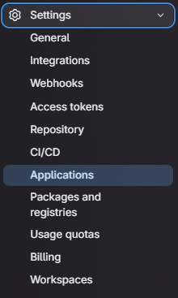
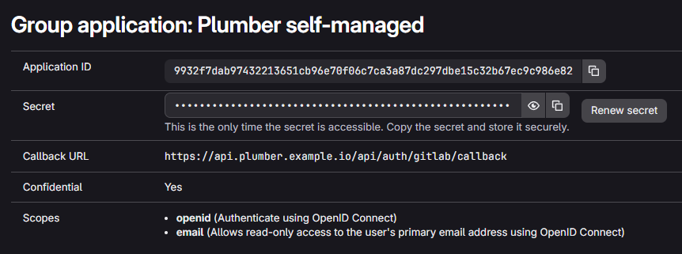

This page describes how to run a self-managed instance of Plumber on
**Kubernetes**.

## 💻 Requirements

- **GitLab instance version >=17.7**
- **A PostgreSQL instance version >= 13** (or let the chart deploy one for you)
- **A Redis instance version >= 6** (or let the chart deploy one for you)
- A Kubernetes cluster with:
  - One ingress controller(ex: [Nginx](https://artifacthub.io/packages/helm/ingress-nginx/ingress-nginx) or [Traefik](https://artifacthub.io/packages/helm/traefik/traefik))
  - A certificate manager with a ACME provider: [cert-manager](https://artifacthub.io/packages/helm/cert-manager/cert-manager)
  - _If you let the chart deploy PostgreSQL or Redis, or if you run external services in Kubernetes_: the ability to provision persistent volumes in your cluster
- Your local environment with CLI to interact with Kubernetes API:
  - [Helm](https://github.com/helm/helm)
  - [Kubectl](https://github.com/kubernetes/kubectl)
- Write access to the DNS zone of the domain to use with Plumber
- A user account on the GitLab instance

## 🛠️ Installation

The Helm chart used in this documentation allows installing all these services
embedded in the chart as dependencies or to use external `PostgreSQL`
and/or `Redis`. The chart can optionally deploy a standalone PostgreSQL or
Redis instance for you. Both alternatives are detailed below.

<Steps>

1. ### 📥 Initialize your cluster

   Create the namespace for Plumber
   ```sh
   kubectl create ns plumber
   ```

   Add Plumber repo
   ```sh
   helm repo add plumber https://charts.getplumber.io/
   ```

2. ### 📄 Configure Domain name

   <Aside variant="info">
   You need a domain to run Plumber. For example, if you have the domain name
   `mydomain.com` then Plumber URL will be `https://plumber.mydomain.com`
   </Aside>

   Create DNS record

   <Steps>
   1. Name: `<your_plumber_domain>`
   2. Type: `A`
   3. Content: `<your-cluster-public-ip>`
   </Steps>

3. ### 🦊 Configure GitLab OIDC

   Plumber uses GitLab as an OAuth2 provider to authenticate users. Let's see how
   to connect it to your GitLab instance.

   Choose a group on your GitLab instance to create an application. It can be any
   group. Open the chosen group in GitLab interface and navigate through
   `Settings > Applications`:

   <div style="max-width: 300px;">

   

   </div>

   Then, create an application with the following information

   <Steps>
   1. Name: `Plumber self-managed`
   2. Redirect URI : `https://<your_plumber_domain>/api/auth/gitlab/callback`
   3. Confidential: `true` (let the box checked)
   4. Scopes: `api`
   </Steps>

   Click on `Save Application` and you should see the following screen:

   

   Store `Application ID` and `Secret` somewhere safe, we will need to use them
   in next step

4. ### ⚙️ Configure your values

   This section describes how to configure your custom values file. The default
   `values.yaml` is available
   [here](https://github.com/getplumber/platform/blob/main/charts/plumber/values.yaml).
   An [example](#-configuration-example) is available at the end of this documentation.

   <Aside variant="info">
   For the following sections, we assume that your custom value file will be
   located in your current directory and be named `custom_values.yaml`
   </Aside>

   **Secrets**

   **This section is optional**. You need to follow this section only if you want
   to store secrets values as kubernetes secrets instead of writing them in your
   custom value file.

   **Plumber secret**

   Replace all occurrences of `REDACTED` by your Plumber secrets encoded in
   base64 and create following secret:
   <Steps>
   1. `secret-key`: 256 bit secret key used to encrypt sensitive data (`openssl rand -hex 32`)
   2. `gitlab-oauth2-client-id`: Application ID of the GitLab application
   3. `gitlab-oauth2-client-secret`: Secret of the GitLab application
   </Steps>

    ```yaml
    apiVersion: v1
    kind: Secret
    metadata:
      name: plumber-secret
      namespace: plumber
    type: Opaque
    data:
      secret-key: REDACTED
      gitlab-oauth2-client-id: REDACTED
      gitlab-oauth2-client-secret: REDACTED
    ```

   **PostgreSQL secret**

    Replace `REDACTED` by your postgres password encoded in base64. If you want
    to use postgres embedded in this chart, choose the value.

    ```yaml
    apiVersion: v1
    kind: Secret
    metadata:
        name: postgresql-secret
        namespace: plumber
    type: Opaque
    data:
        password: REDACTED
    ```

   **Redis secret**

    Replace `REDACTED` by your redis password encoded in base64. If you want to
    use redis embedded in this chart, choose the value.

    ```yaml
    apiVersion: v1
    kind: Secret
    metadata:
        name: redis-secret
        namespace: plumber
    type: Opaque
    data:
        password: REDACTED
    ```

   **Plumber**

   Add Plumber related configuration in your new values file `custom_values.yaml`:

   Add Plumber domain

   ```yaml
   front:
     host: 'plumber.mydomain.com'

   jobs:
     host: 'plumber.mydomain.com'

     # Not using secret for configuration (comment if you use secret)
     extraEnv:
       - name: SECRET_KEY
         value: '<secret-key>'
       - name: GITLAB_OAUTH2_CLIENT_ID
         value: '<gitlab-oauth2-client-id>'
       - name: GITLAB_OAUTH2_CLIENT_SECRET
         value: '<gitlab-oauth2-client-secret>'

     # Using existing secret for configuration (uncomment if you use secret)
     #extraEnv:
     #  - name: SECRET_KEY
     #    valueFrom:
     #      secretKeyRef:
     #        name: "plumber-secret"
     #        key: "secret-key"
     #  - name: GITLAB_OAUTH2_CLIENT_ID
     #    valueFrom:
     #      secretKeyRef:
     #        name: "plumber-secret"
     #        key: "gitlab-oauth2-client-id"
     #  - name: GITLAB_OAUTH2_CLIENT_SECRET
     #    valueFrom:
     #      secretKeyRef:
     #        name: "plumber-secret"
     #        key: "gitlab-oauth2-client-secret"

   worker:
     replicaCount: 5 # Default is 5. Increase it depending of your needs
   ```

   Add your GitLab instance domain and organization

   <Steps>
   1. **If you want to connect Plumber to a specific GitLab group only**: add the path of the group in `organization` (to run the onboarding, you must be at least **Maintainer in this group**)
       ```yaml
       gitlab:
           domain: 'https://gitlab.mydomain.com'
           organization: '<group-path>'
       ```

   2. **If you want to connect Plumber to the whole GitLab instance**: let `organization` empty (to run the onboarding, you must be a **GitLab instance Admin**)
       ```yaml
       gitlab:
           domain: 'https://gitlab.mydomain.com'
           organization: ''
       ```
   </Steps>

   Add your Ingress configuration

   ```yaml
   ingress:
     enabled: true
     className: '' # Add class name for your ingress controller
     annotations: {} # Add annotation required by your ingress controller or certificate manager
   ```

   (Optional) Add your custom Certificate Authority

   You can either:

   <Steps>
   1. Reference an existing secret containing your CA public root certificate
      using the `existingSecret` key.
   2. Or manually add your CA public root certificate in the values using the
      `certificates` key.
   </Steps>

   ```yaml
   customCertificateAuthority:
     existingSecret: ""
     certificates: []
     # - name: rootCA.crt # Must have the .crt extension
     #   value: |
     #     -----BEGIN CERTIFICATE-----
     #     (SNIPPED FOR BREVITY)
     #     -----END CERTIFICATE-----
   ```

   **PostgreSQL**

   You can either let the chart deploy a standalone PostgreSQL instance or
   use an external one.

   **Option A: Deploy PostgreSQL via the chart**

   When `postgresql.deploy: true`, the chart provisions a single-replica
   PostgreSQL `StatefulSet`, a headless `Service` named
   `<release>-postgresql`, and a `PersistentVolumeClaim` for the data
   directory. The backend and worker pods automatically get an
   `initContainer` that waits for PostgreSQL to be ready before starting.

   <Aside variant="caution">
   The bundled PostgreSQL is intended for evaluation, development, and
   small self-managed deployments. For production workloads we recommend
   using a managed database via **Option B**.
   </Aside>

   ```yaml
   postgresql:
     deploy: true

     custom:
       dbName: 'plumber'
       sslmode: 'disable'
       port: 5432

     global:
       postgresql:

         # Not using secret for auth (comment if you use secret)
         auth:
           username: REPLACE_ME_BY_POSTGRES_USERNAME
           postgresPassword: REPLACE_ME_BY_POSTGRES_PASSWORD

         # Using existing secret for auth password (uncomment if you use secret)
         #auth:
         #  username: plumber
         #  existingSecret: "postgresql-secret"
         #  secretKeys:
         #    adminPasswordKey: "password"
         #    userPasswordKey: "password"

     # Persistence for the PostgreSQL data directory
     persistence:
       size: '10Gi'
       storageClass: '' # leave empty to use the cluster default StorageClass
       accessMode: ReadWriteOnce

     # To pull from a private registry or pin an exact version, uncomment and configure:
     #image:
     #  registry: my-private-registry.example.com  # omit to use Docker Hub
     #  repository: postgres                        # defaults to official Postgres image
     #  tag: "18"
     #  digest: ""  # optional: pin exact version with sha256:...
     #  pullPolicy: IfNotPresent
   ```

   **Option B: Use an external PostgreSQL**

   ```yaml
   postgresql:
     deploy: false

     custom:
       host: REPLACE_ME_BY_POSTGRES_HOST
       dbName: REPLACE_ME_BY_POSTGRES_DB_NAME
       sslmode: 'require'
       port: 5432

     global:
       postgresql:

         # Not using secret for auth (comment if you use secret)
         auth:
           username: REPLACE_ME_BY_POSTGRES_USERNAME
           postgresPassword: REPLACE_ME_BY_POSTGRES_PASSWORD

         # Using existing secret for auth password (uncomment if you use secret)
         #auth:
         #  username: plumber
         #  existingSecret: "postgresql-secret"
         #  secretKeys:
         #    adminPasswordKey: "password"
         #    userPasswordKey: "password"
   ```

   **Redis**

   You can either let the chart deploy a standalone Redis instance or use an
   external one.

   **Option A: Deploy Redis via the chart**

   ```yaml
   redis:
     deploy: true

     # Not using secret for auth (comment if you use secret)
     auth:
       password: REPLACE_ME_BY_REDIS_PASSWORD

     # Using existing secret for auth (uncomment if you use secret)
     #auth:
     #  existingSecret: "redis-secret"
     #  existingSecretPasswordKey: "password"

     # To pull from a private registry or pin an exact version, uncomment and configure:
     #image:
     #  registry: my-private-registry.example.com  # omit to use Docker Hub
     #  repository: redis                           # defaults to official Redis image
     #  tag: "8.4"
     #  digest: ""  # optional: pin exact version with sha256:...
     #  pullPolicy: IfNotPresent
   ```

   **Option B: Use an external Redis**

   ```yaml
   redis:
     deploy: false

     custom:
       port: 6379
       host: REPLACE_ME_BY_REDIS_HOST
       user: REPLACE_ME_BY_REDIS_USENAME
       cert: |
         REPLACE_ME_BY_REDIS_TLS_CERTIFICATE

     # Not using secret for auth (comment if you use secret)
     auth:
       password: REPLACE_ME_BY_REDIS_PASSWORD

     # Using existing secret for auth (uncomment if you use secret)
     #auth:
     #  existingSecret: "redis-secret"
     #  existingSecretPasswordKey: "password"
   ```

5. ### 🚀 Install the chart

   ```sh
   helm upgrade -n plumber --create-namespace --install plumber plumber/plumber -f custom_values.yaml
   ```

   <Aside variant="tip">
   You have successfully installed Plumber on your Kubernetes cluster 🎉
   </Aside>

</Steps>

### 📚 Configuration example

<Aside variant="info">
This example run in a Kubernetes cluster using:
- `nginx` as ingressController
- `cert-manager`
- A clusterIssuer named `letsencrypt-production`

```yaml
front:
  host: "plumber.mydomain.com"

jobs:
  host: "plumber.mydomain.com"
  extraEnv:
    - name: SECRET_KEY
      value: "REDACTED"
    - name: GITLAB_OAUTH2_CLIENT_ID
      value: "REDACTED"
    - name: GITLAB_OAUTH2_CLIENT_SECRET
      value: "REDACTED"

gitlab:
  domain: "https://gitlab.mydomain.com"

worker:
  replicaCount: 5

ingress:
  enabled: true
  className: "nginx"
  annotations:
    cert-manager.io/cluster-issuer: "letsencrypt-production"

# Option A: Use an external PostgreSQL
postgresql:
  deploy: false
  global:
    postgresql:
      auth:
        username: REDACTED
        postgresPassword: REDACTED
  custom:
    host: "database-1.REDACTED.us-east-1.rds.amazonaws.com"
    port: 5432
    dbName: "plumber"
    sslmode: "require"

# Option B: Deploy PostgreSQL via the chart
#postgresql:
#  deploy: true
#  global:
#    postgresql:
#      auth:
#        username: REDACTED
#        postgresPassword: REDACTED
#  custom:
#    dbName: "plumber"
#    sslmode: "disable"
#    port: 5432
#  persistence:
#    size: "10Gi"

# Option A: Deploy Redis via the chart
redis:
  deploy: true
  auth:
    password: REDACTED

# Option B: Use an external Redis
#redis:
#  deploy: false
#  auth:
#    password: REDACTED
#  custom:
#    port: 6379
#    host: "REDACTED"
#    user: "REDACTED"
#    cert: |
#      -----BEGIN CERTIFICATE-----
#      REDACTED
#      -----END CERTIFICATE-----
```
</Aside>

## ⏫ Update

<Steps>

1. Update Plumber Helm repository
   ```sh
   helm repo update
   ```

2. Run the helm upgrade
   ```sh
   helm upgrade -n plumber --install plumber plumber/plumber -f custom_values.yaml
   ```

3. You have successfully updated Plumber 🎉

</Steps>
